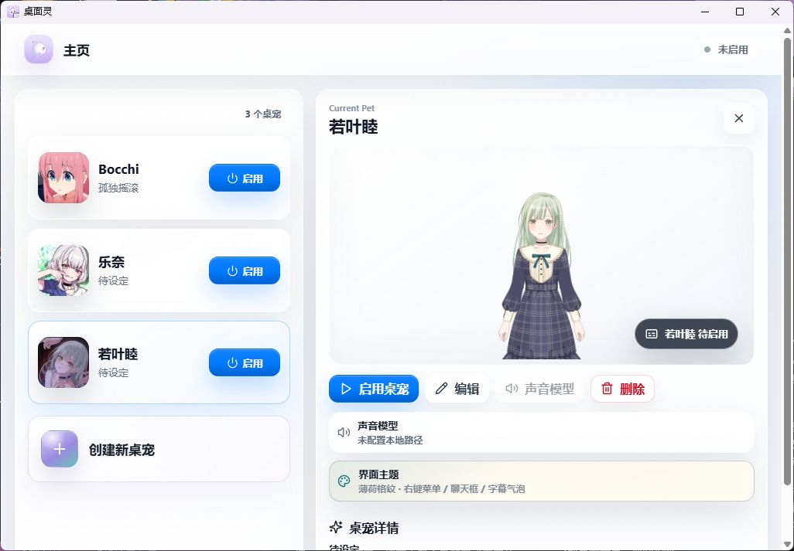
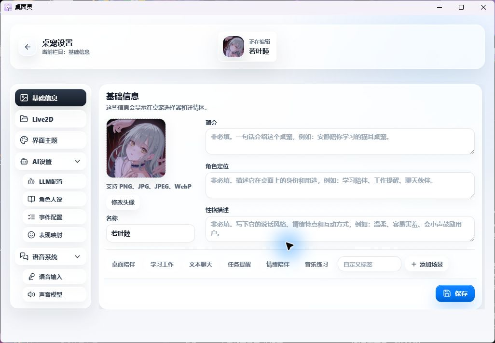
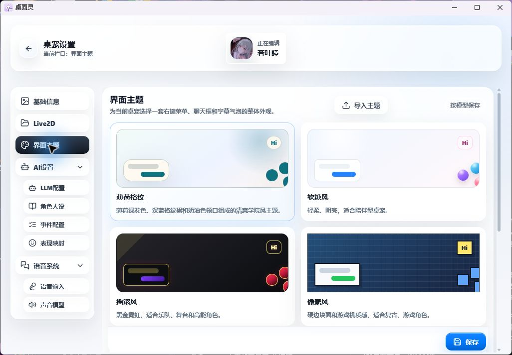
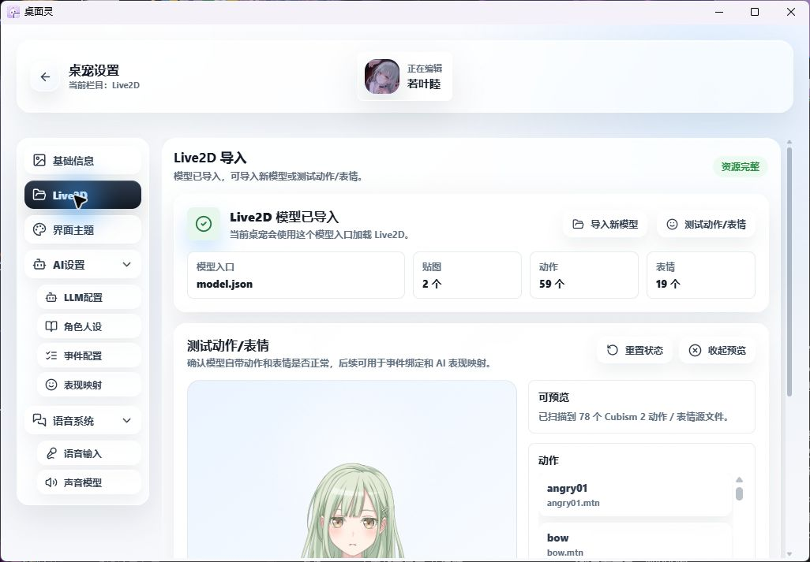
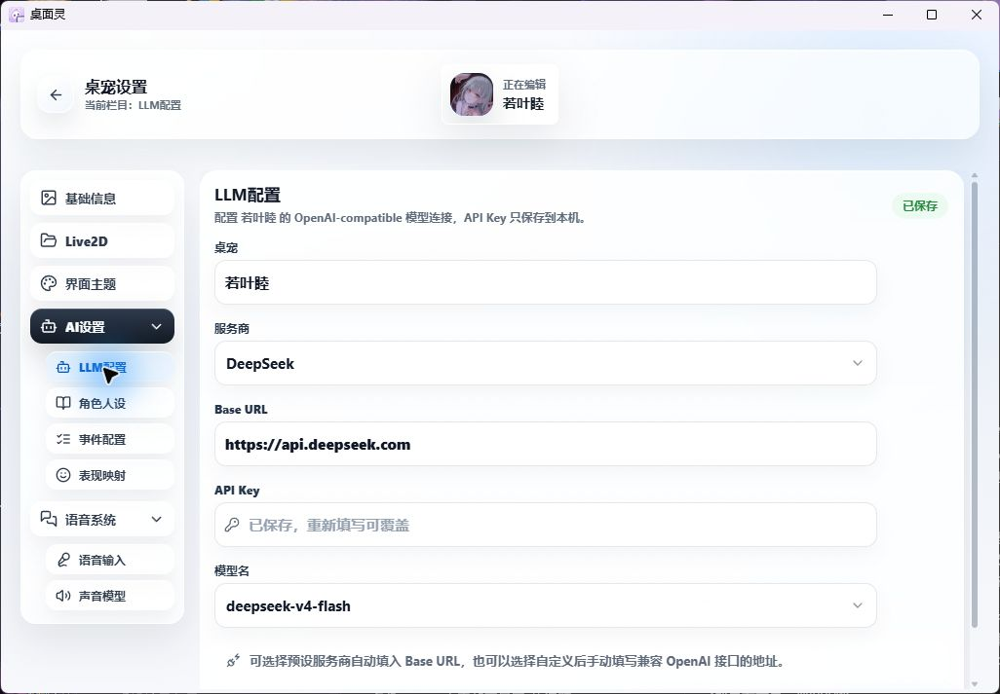
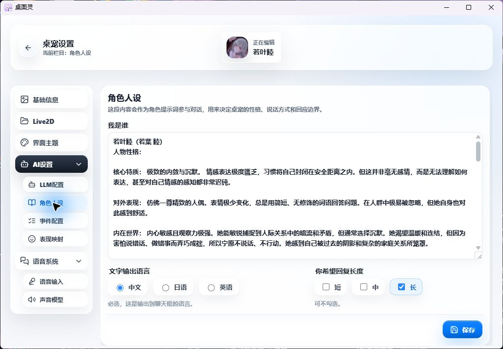
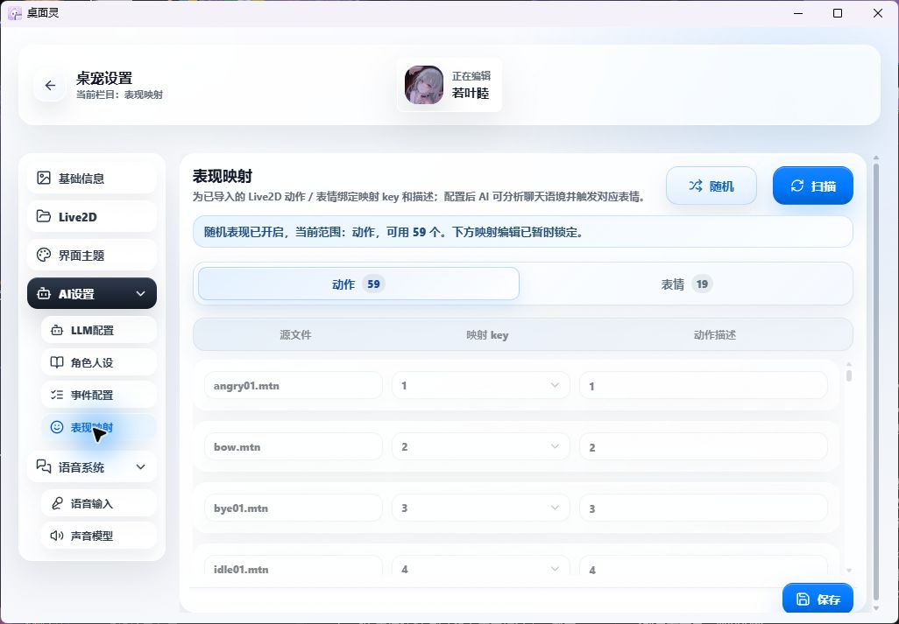
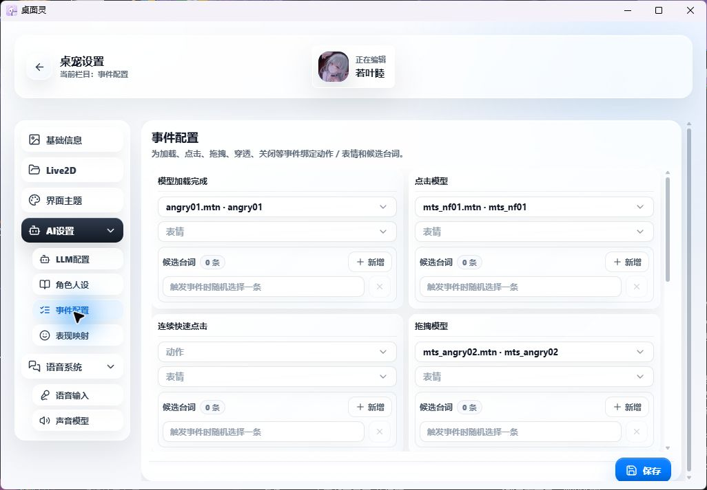
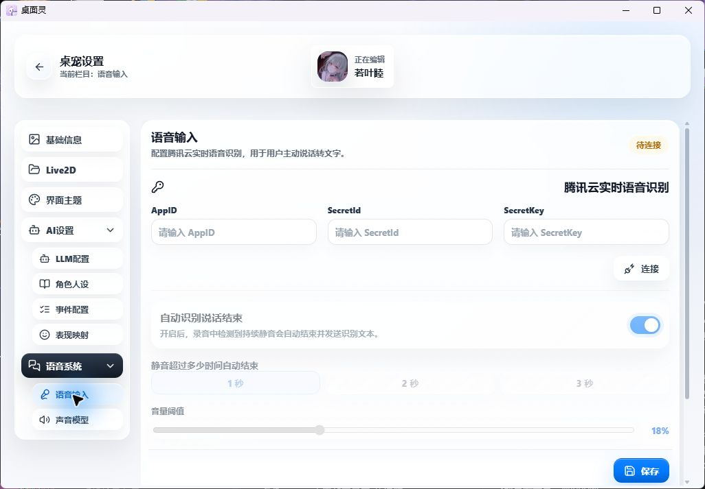
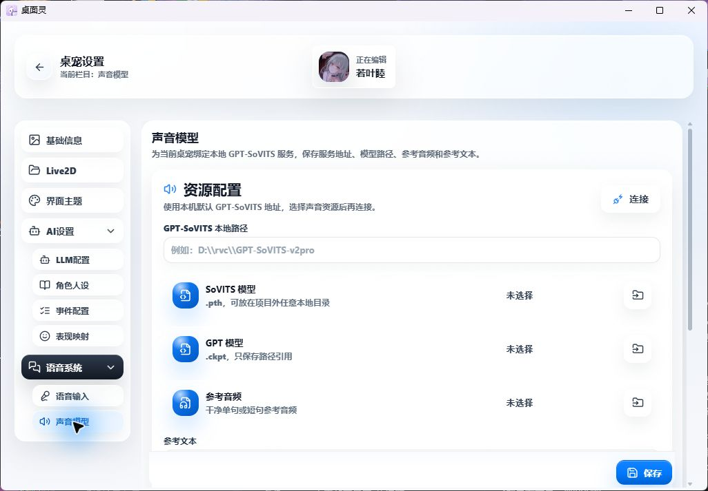

# 桌面灵

简体中文


一款**开源、可自定义、本地优先的 Live2D 桌宠软件框架**。用户可以导入自己的 Live2D 模型，配置桌宠资料、人设、事件台词、AI 聊天、可选语音输入和可选语音回复，创建属于自己的桌面伙伴。

> 桌面灵不内置受版权限制的角色模型、声音模型、参考音频、AI Key 或云服务密钥。开源版提供的是桌宠框架和配置工具，真实角色资源由用户自行导入并保存在本机。

**功能**：透明桌宠窗口 · Cubism 2/3/4/5 Live2D 文件夹导入 · 模型预览 · 动作/表情扫描 · 表现映射 · 事件台词 · AI 聊天 · 字幕气泡 · 语音输入 · GPT-SoVITS 语音回复 · 多桌宠本地配置

**当前主要平台**：Windows

---

## 界面预览

> 下图为本机演示配置截图。若叶睦模型资源不随开源仓库发布，开源版默认不携带任何受版权限制的角色资源。



---

## 功能概览

### 1. 桌宠选择器

桌宠选择器是软件主入口，用来查看和管理本机桌宠：

- 查看已创建桌宠列表
- 选择桌宠并查看详情
- 启用或关闭桌宠窗口
- 进入编辑器修改配置
- 查看声音模型和界面主题状态
- 删除本地桌宠

未导入 Live2D 模型的桌宠会显示为“待导入”，需要先进入编辑器完成模型导入后才能启用。

> 

### 2. 本地桌宠编辑器

每个桌宠都有独立配置。编辑器目前包含：

- **基础信息**：头像、名称、简介、角色定位、性格描述、适合场景
- **界面主题**：右键菜单、聊天框、字幕气泡的整体外观
- **Live2D**：选择模型文件夹、资源检查、模型预览、动作/表情测试
- **LLM 配置**：OpenAI-compatible 服务商、Base URL、API Key、模型名
- **角色人设**：角色提示词、文字输出语言、回复长度
- **表现映射**：使用导入时自动识别的动作/表情源，预览后绑定自定义 key 和中文描述
- **事件配置**：为点击、拖拽、穿透、关闭等事件绑定表现和候选台词，并可在桌面桌宠中预览
- **语音输入**：腾讯云实时语音识别配置
- **声音模型**：GPT-SoVITS 本地路径、模型文件、参考音频和参考文本

编辑器支持未保存修改提示，切换栏目时会提醒用户保存当前页面。

> *(基础信息)*
> 
>
> *(界面主题)*
> 

### 3. Live2D 导入和预览

用户选择的是**完整 Live2D 模型文件夹**，不是单独选择入口文件。软件会自动识别文件夹中的模型入口。

当前支持：

- Cubism 2：`model.json` / `.moc`
- Cubism 3 / 4 / 5：`.model3.json` / `.moc3`

导入时会检查：

- 模型入口
- Moc 文件
- 贴图
- 动作
- 表情
- 物理配置

导入前可以预览模型，确认显示、大小、位置、动作和表情是否正常。导入后，模型资源会保存到本机用户数据目录，仓库不会保存用户真实模型。

> 

### 4. AI 聊天

桌面灵支持 OpenAI-compatible AI 服务。每个桌宠可以单独配置：

- Base URL
- API Key
- 模型名
- 人设提示词
- 输出语言
- 回复长度

AI 配置只保存到本机。Base URL、模型名等非敏感元数据保存在
`%APPDATA%/zhuomianling/ai-connections.json`；API Key 由 Electron
`safeStorage` 加密后保存在 `secure-secrets.json`，不会写入普通 JSON，
也不会返回给渲染进程。开源仓库不会提供默认 Key，也不会绑定任何云端服务。

> *(LLM 配置)*
> 
>
> *(角色人设)*
> 

### 5. 表现映射和事件反馈

导入 Live2D 时会自动识别模型中的动作和表情文件。进入表现映射或事件配置后，可直接在桌面桌宠中预览它们，再为它们设置：

- 映射 key，例如 `happy`、`panic`、`idle`
- 中文描述，例如“开心微笑”“慌张后退”“待机动作”

保存后的表现可以用于：

- AI 回复时自动触发表情或动作
- 事件配置中手动绑定触发表现
- 点击、拖拽、打开聊天、关闭桌宠等场景反馈

> *(表现映射)*
> 
>
> *(事件配置)*
> 

### 6. 透明桌宠窗口

启用桌宠后，会打开透明无边框桌宠窗口。桌宠窗口支持：

- 右键圆形快捷菜单
- 聊天框
- 字幕气泡
- 触控拖拽
- 点击穿透
- 关闭和恢复

点击穿透开启后，桌宠会尽量不阻挡桌面操作；需要恢复交互时，可以从快捷菜单、选择器或托盘关闭穿透。

### 7. 可选语音能力

语音能力不是必需项。未配置语音时，桌宠仍可正常进行文字聊天和字幕显示。

**语音输入**：

- 使用腾讯云实时语音识别
- 用户主动触发录音
- 支持自动识别说话结束、音量阈值和连续对话
- 不做后台监听，不做无提示录音

**语音回复**：

- 使用本机 GPT-SoVITS
- 用户自行准备声音模型、参考音频和参考文本
- 可选择逐句播放或完整生成后播放
- 可开启“语音与文字一起输出”

> *(语音输入)*
> 
>
> *(声音模型)*
> 

---

## 安装与运行

### 从源码运行

前置要求：

- Node.js 18+
- npm 9+
- Windows 10 / 11

安装依赖：

```powershell
npm install
```

开发模式运行：

```powershell
npm run dev
```

类型检查和构建：

```powershell
npm run typecheck
npm run build
```

`npm run build` 会在构建末尾执行发布资源审计。开发机上的
`public/live2d/` 模型不会复制到 `dist/`；如果构建产物中出现 Live2D
模型、声音模型、参考音频或本地私密配置，构建会直接失败。

### 构建 Windows 安装包

```powershell
npm run dist:win
```

打包命令只允许把 `public/icons/` 与 `public/vendor/` 中的公开运行时静态
资源带入发布包，并会复用同一套发布资源审计。不要手工把
`public/live2d/` 或 `userData/pets/` 复制到 `dist/` / `release/`。
安装包生成后还会自动运行 `verify:packed-assets`，直接检查实际
`app.asar` 中是否混入禁止资源或生产 `node_modules`。

构建产物会输出到：

```text
release/
```

其中：

- `桌面灵 Setup <版本号>.exe`：安装包
- `桌面灵.exe`：免安装版

### 预览生产构建

如果想测试接近打包后的运行效果，但不生成安装包：

```powershell
npm run preview:prod
```

如果只是重新打开上一次构建结果：

```powershell
npm run start:prod
```

---

## 本地数据与隐私

桌面灵是本地优先的桌面软件。用户创建的桌宠、头像、Live2D 模型、AI 设置、人设、事件台词和语音配置默认保存在本机。

Windows 上通常位于：

```text
%APPDATA%/zhuomianling/
```

桌宠数据通常位于：

```text
%APPDATA%/zhuomianling/pets/<pet-id>/
```

请注意：

- AI API Key 以及腾讯云 AppID、SecretId、SecretKey 只在主进程中使用，
  由 Electron `safeStorage` 加密保存；普通桌宠 JSON 和渲染进程只会看到
  `hasApiKey` / `hasCredentials` 这类状态
- 旧版 `ai-connections.json` 和 `pet.local.json` 中的明文凭据会在升级后
  自动迁移；只有加密写入并回读验证成功后，程序才会删除旧明文字段
- `secure-secrets.json` 受当前 Windows 用户的系统加密能力保护；把本地数据
  复制到另一台电脑或另一个系统账户后，通常需要重新填写云服务凭据
- 声音模型路径等非密钥本机配置仍只应保存在本机
- 不要把 `.env`、`*.local.json`、真实 Key 或本地绝对路径提交到仓库
- 不要把未授权 Live2D 模型、声音模型、参考音频、`.pth`、`.ckpt` 提交到仓库
- 更换电脑或重装系统前，请自行备份需要保留的本地桌宠数据

---

## 开源版不包含

- 受版权限制的 Live2D 模型、贴图、动作或角色图片
- 内置商业 / 动漫 / 游戏角色配置
- API Key、Token、腾讯云密钥或 AI 服务密钥
- GPT-SoVITS 声音模型、参考音频、`.pth`、`.ckpt` 或生成音频
- 云端 AI 服务或托管后端

---

## 文档

- [用户使用指南](docs/user-guide.md)
- [资源与隐私边界](docs/resource-policy.md)

---

## 技术栈

- [Electron](https://www.electronjs.org/)：桌面应用外壳
- [React](https://react.dev/)：渲染进程 UI
- [TypeScript](https://www.typescriptlang.org/)：类型系统
- [Vite](https://vite.dev/)：开发和构建
- [Live2D Cubism SDK](https://www.live2d.com/en/sdk/about/)：Live2D 模型运行时
- [lucide-react](https://lucide.dev/)：界面图标
- GPT-SoVITS：可选本地语音回复服务
- 腾讯云实时语音识别：可选语音输入服务

---

## 第三方运行时声明

本项目包含 Live2D runtime / Cubism SDK 相关文件，用于加载和驱动 Live2D 模型。这些文件不属于本项目原创代码。

使用、复制、分发或发布包含 Live2D runtime / Cubism SDK 文件的软件时，请遵守 Live2D 官方许可条款。详见 [NOTICE](NOTICE)。

---

## 致谢

感谢以下项目和生态提供的基础能力：

- Electron
- React
- Vite
- TypeScript
- Live2D Cubism SDK
- lucide-react
- GPT-SoVITS

也感谢所有愿意尝试、反馈和贡献自定义桌宠工作流的用户。

---

## 许可证

本项目开源代码采用 [MIT License](LICENSE)。

Live2D runtime / Cubism SDK 相关文件遵循 Live2D 官方许可条款；用户导入的角色模型、声音模型、参考音频等资源由用户自行确认授权。

---

## 免责声明

本项目仅提供桌宠软件框架和本地配置工具。使用者需要自行确保导入的 Live2D 模型、角色图片、声音模型、参考音频、AI 服务和云服务配置拥有合法使用权。

项目作者不对用户自行导入、生成、配置或分发的第三方资源承担授权责任。
