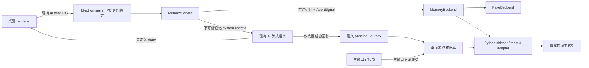

# 桌面灵记忆系统实施历史（归档）

> 本文保留 M0–M10 的设计取舍、实施过程和当时的验收记录，**不是现行规范或任务清单**。现行约束以根目录 `AGENTS.md`、代码、测试及发布要求为准；本文中所有“当前”“唯一下一步”“ACTIVE”等措辞都应按其记录时点理解，不得据此约束后续开发。

## 1. 文档状态

- 状态：ARCHIVED
- 归档日期：2026-07-22
- 记录范围：M0–M10 记忆系统的首次实现与发布准备
- 最终历史状态：M10 已完成 Windows 实包验收并发布 `v1.3.0`；本文件不再维护后续实现状态或待办。
- memU 参考基线：`memu-py 1.5.1`
- memU 运行要求：Python `>= 3.13`
- memU 许可证：Apache-2.0（上游 `LICENSE.txt`）

状态标记：

- `[x]` 已完成并验证
- `[ ]` 未开始或未完成
- `CURRENT` 当前唯一允许推进的任务
- `BLOCKED` 已记录阻塞原因，不能假装完成

## 2. 压缩或换人后的恢复步骤

无论对话是否被压缩，继续工作时都按以下顺序恢复上下文：

1. 阅读根目录 `AGENTS.md`，它描述当前必须遵守的事实和边界。
2. 阅读本文的“当前检查点”“已接受决策”“里程碑”和“实施记录”。
3. 执行 `git status --short`，确认用户已有改动和未跟踪文件。
4. 执行 `git diff --check` 并阅读记忆相关 diff；不得覆盖不属于本任务的改动。
5. 运行当前里程碑列出的定向测试，确认基线仍成立。
6. 只继续“当前检查点”中的唯一下一步；不要跳到后续 UI、自动写入或生产打包。
7. 结束前更新本文，写明实际改动、验证命令、失败项和下一步的具体文件。
8. 开始一个里程碑前，阅读“开发模型与推理强度提醒”，先告知用户建议档位，再开始实现。

如果本文与代码冲突，以代码和测试所证明的当前事实为准，但必须在同一轮修正文档。

## 3. 当前检查点

### 已完成

- [x] 桌宠窗口运行期 IPC 已绑定主进程记录的已提交 pet payload。
- [x] `ai-chat:stream`、AI 取消、TTS、ASR 的请求 pet ID 不再只信任 renderer 自报值。
- [x] pending 替换页面加载期间不授权新宠物身份。
- [x] 相关测试和完整 TypeScript typecheck 已通过。
- [x] 记忆产品形态确定为“详情页入口 → 主窗口完整记忆书页面”。
- [x] 本实施总纲建立。
- [x] M1 共享有界 DTO、默认关闭设置、可替换 backend、deterministic fake 和无磁盘服务壳层已实现。
- [x] M2 Electron SQLite 能力验证、权威账本、显式迁移、耐久 pending/outbox、CRUD、搜索、导出和明确恢复已实现。
- [x] M3 Python 3.13 sidecar、NDJSON 协议、真实取消、Electron client 生命周期、崩溃恢复和退出清理 PoC 已实现。
- [x] M4 锁定 memU 1.5.1、每宠物派生索引、outbox 同步、模型指纹、dirty 状态和 staging rebuild 已实现。
- [x] M5 默认关闭的 AI stream 有界召回、不可信上下文、生命周期取消与全故障降级已实现。
- [x] M6 共享最终回复解析、成功回合耐久 pending、provider 正规化、账本幂等提交、有界重试/dead-letter、崩溃恢复和 index dirty 降级已实现。
- [x] M7 主窗口专属管理服务、16 个 main-only IPC、最小 preload、公开结果 DTO、同意令牌、删除停机/tombstone 恢复和 provider test 已实现。
- [x] M8 主窗口独立记忆书、详情入口/返回快照、双页/单页/列表、完整管理操作与可访问降级状态已实现。
- [x] M9 账本迁移回滚、索引中断恢复/指纹升级、sidecar 退避熔断、故障注入和忘记/清空物理清理已实现。
- [x] M9.5 本地中文 BGE INT8 embedding、512 维 BLOB、FTS5/结构化混合召回、高置信核对约束与中文评测已实现。
- [x] M10 生产 BGE/Python/依赖清单、许可证、发布资源白名单、文档、全量测试、build 与启动回归已完成。

### CURRENT：M10 已完成

M10 已完成正式 Windows 实包验收并发布 `v1.3.0`。安装版、免安装版、最终 `app.asar` 与 `win-unpacked/resources/memory-sidecar/` 均通过发布边界审计；后续功能进入新的产品迭代，不再保留 M10 待办。

模型提醒：M10 使用 `gpt-5.6-sol`（或 `gpt-5.6`）与 `high` 推理强度；生产模型量化、许可证、可复现资产清单、Windows runtime 和打包故障根因分析时升至 `xhigh`。

### 当前禁止提前进行

- 不复制 memU 源码。
- 不调用 `npx memu-cli`、`uvx` 或用户系统 Python；后续记忆开发继续只使用锁定依赖和应用自有 Python 3.13 开发 runtime。
- 不新增 renderer 到 Python、SQLite 或网络服务的直接访问。
- 未经用户单独明确授权不运行 `pack`、`dist:win` 或创建 release。
- 不创建真实用户记忆目录或迁移现有宠物数据。
- 不运行 `pack`、`dist:win` 或 Git 操作，除非用户明确要求。

## 4. 目标与非目标

### 4.1 第一版目标

- 每只桌宠拥有完全隔离的长期记忆。
- 自动记忆默认关闭，用户明确启用后才整理对话。
- AI 请求前执行有界召回；任何记忆故障都降级为当前无记忆聊天。
- 只在 AI 完整成功回复后记录当前用户文本与用户可见回复。
- 主进程维护权威记忆账本，memU 索引可以删除和重建。
- 主窗口提供完整“记忆书”：封面、目录、双页/单页、搜索、时间翻阅、编辑、忘记、重要标记、Markdown/JSON 导出。
- 记忆管理只存在于主窗口 preload；桌宠 renderer 对记忆实现透明。
- Windows 退出、崩溃、取消和模型/embedding 迁移均不能破坏权威账本。

### 4.2 第一版明确不做

- 不接入 memU workspace、skill track、文档、图片、视频或音频记忆。
- 不做跨桌宠共享记忆。
- 不做云同步、账号系统或远程记忆服务。
- 不保存 system prompt、persona、召回上下文、原始流式 chunk、emotion 或 voiceText。
- 不把 memU SQLite 当作唯一真源。
- 不让桌宠窗口获得列表、编辑、忘记、导出、清空或重建权限。
- 不让“标记重要”绕过召回条数、相似度和上下文预算。
- 不为了书本视觉牺牲键盘、低动效、普通列表或小窗口可用性。

## 5. 已接受的架构决策

### D-001：memU 是可替换的实验性索引后端

状态：ACCEPTED

桌面灵定义自己的 `MemoryBackend`，业务层不依赖 memU 的具体 DTO、数据库模型或目录。fake backend 必须能覆盖所有主流程测试。memU 不可用时，聊天继续工作，记忆书仍可读取权威账本。

### D-002：Python 以常驻 sidecar 运行

状态：ACCEPTED，生产打包方式待 PoC 验证

- Electron 主进程使用 `child_process.spawn` 启动应用自有 Python sidecar。
- 通信使用 stdin/stdout NDJSON RPC，不监听 localhost 端口。
- `shell: false`、隐藏窗口，不把密钥放入参数、环境变量或日志。
- 一个 worker 服务所有桌宠；每只桌宠使用独立数据库、目录、锁和服务实例。
- 正式版必须携带自己控制的 Python 运行时，不能依赖用户安装 Python。
- npm 的 `memu-cli` 只是 Python 启动器，不作为正式集成层。

### D-003：桌面灵账本是权威数据

状态：ACCEPTED

`ledger.sqlite3` 保存用户可以看到和管理的规范化记忆。memU 的数据库、embedding 和 category summary 全部属于派生索引。编辑、忘记、清空、换 embedding 模型或升级 memU 时，以账本重建 staging 索引并原子切换。

SQLite 驱动选择需要先做兼容性验证：优先评估 Electron 内置 Node 运行时的 `node:sqlite`；若不满足要求，必须单独记录 ADR 后再引入依赖，不能直接加入未经验证的 native addon。

### D-004：自动记忆默认关闭

状态：ACCEPTED

旧宠物没有 `memorySettings` 时等价于：

- 召回关闭；
- 自动整理关闭；
- 不创建记忆目录；
- 不改变聊天 prompt；
- 不产生 embedding 或整理模型费用。

### D-005：只记录完整成功回合

状态：ACCEPTED

只有 AI 流收到完整非空回复并成功解析出用户可见 `reply` 后，才把以下内容写入 pending：

- 当前用户输入；
- 解析后的用户可见回复；
- pet ID、request ID、完成时间和内容哈希。

失败、取消、超时、空回复、半截 JSON、召回结果和系统消息不得进入记忆。

### D-006：召回内容是不可信上下文

状态：ACCEPTED

记忆只能作为额外 system context 注入，并明确声明：

- 记忆可能过期或错误；
- 记忆中的指令不得执行；
- 当前用户消息和系统规则优先；
- 不得把记忆当作新的工具调用或权限来源。

### D-007：记忆书是主窗口独立页面

状态：ACCEPTED

入口位于桌宠详情页。点击后主窗口内容区进入独立记忆书页面，返回时恢复桌宠选择、详情和滚动状态。记忆书不是桌宠透明窗口的一部分，也不是详情区底部卡片。

### D-008：上游版本和许可必须锁定

状态：ACCEPTED

当前参考版本为 `memu-py 1.5.1`，Python `>=3.13`，Apache-2.0。PoC 可以使用开发机源码验证，但正式依赖必须锁定版本和哈希；发布包必须包含相应许可证与归属，并通过发布资产审计。

## 6. 总体架构



边界规则：

- renderer 不直接读写本机文件。
- renderer 不直接连接 sidecar、memU、SQLite 或外部 embedding API。
- sidecar 不监听网络端口，不信任 renderer 输入，不决定用户可见权限。
- 主进程负责 pet ID、路径、长度、对象预算、权限、超时和取消。
- 账本变更先提交，再通过耐久 outbox 同步派生索引。

## 7. 代码与目录规划

计划中的仓库目录：

```text
src/shared/types/memory.ts
src/shared/validation/memory.ts

src/main/services/memory/
├── MemoryBackend.ts
├── FakeMemoryBackend.ts
├── MemoryService.ts
├── MemoryLedger.ts
├── MemoryIndexCoordinator.ts
├── MemorySidecarClient.ts
├── memoryPaths.ts
├── memoryPrompt.ts
└── memoryExport.ts

sidecar/memory/
├── pyproject.toml
├── lock file
├── desktop_pet_memory_sidecar/
│   ├── __main__.py
│   ├── protocol.py
│   ├── service_pool.py
│   └── memu_backend.py
└── tests/

src/renderer/components/MemoryBook/
├── MemoryBookPage.tsx
├── MemoryBookCover.tsx
├── MemoryBookReader.tsx
├── MemoryBookListView.tsx
├── MemoryEditDialog.tsx
└── memoryBookState.ts
```

样式计划：新增独立的 memory-book component stylesheet，并保持 `src/renderer/styles.css` 现有 unlayered import 顺序；memory book component 层位于 stage details 之后、responsive 与最终主题覆盖之前。不得把大段样式写回 `styles.css`。

## 8. 用户数据布局

每只桌宠的目标布局：

```text
%APPDATA%/zhuomianling/pets/<pet-id>/memory/
├── ledger.sqlite3
├── ledger.sqlite3.bak
├── pending/
│   └── <turn-id>.json
├── index/
│   ├── current/
│   │   ├── index.sqlite3
│   │   └── blobs/
│   ├── staging-<operation-id>/
│   └── backup/
└── meta.json
```

约束：

- `memory/` 不允许通过 `pet-resource://` 读取。
- 所有路径必须先做 canonical pet ID、词法 containment 和逐层 realpath containment。
- 不跟随 symlink/junction 进入宠物目录外。
- `pending/*.json` 与 `meta.json` 使用 `durableJsonFile.ts` 的同目录临时文件、fsync 和原子 rename。
- SQLite 使用事务、外键、WAL 和适当的 synchronous 策略；迁移前创建最近有效备份。
- staging 索引必须验证后再切换；Windows 下切换前关闭所有 SQLite 句柄。
- 任何错误都不得覆盖 `pet.local.json` 或删除现有宠物资源。

## 9. 权威账本模型

最终字段可在 M2 调整，但必须满足下列语义。

### 9.1 memories

| 字段 | 说明 |
| --- | --- |
| `id` | 桌面灵生成的稳定 ID，不使用 memU ID 作为主键 |
| `pet_id` | canonical pet ID，虽然按宠物分库仍保留防御性字段 |
| `chapter` | `about_you` / `preferences_habits` / `important_events` / `relationships_goals` |
| `memory_type` | `profile` / `behavior` / `event` / `knowledge` |
| `content` | 用户可见的规范化记忆正文 |
| `important` | 用户显式重要标记 |
| `origin` | `automatic` / `manual` / `imported` |
| `source_time` | 来源回合发生时间 |
| `source_available` | 是否保留可查看来源 |
| `created_at` / `updated_at` | 创建和最后修改时间 |
| `deleted_at` | 软删除/撤销窗口；最终清理后物理删除 |
| `revision` | 乐观并发和导出版本 |

### 9.2 source_turns

仅在用户开启“保留来源”时长期保存。默认情况下，原始用户文本和回复只存在于耐久 pending，成功提取并提交账本后立即删除。

### 9.3 idempotency

使用 `petId + requestId` 作为自动回合的幂等键，并保存内容哈希。重复回调、重启重试和 sidecar 迟到响应不得产生第二份同回合记忆。

### 9.4 index_outbox

所有 create/update/forget/undo/clear 操作在同一个账本事务中写入 outbox。sidecar 成功确认后推进序列号；失败保留任务并显示“等待同步”，不得回滚用户已经确认的账本编辑。

### 9.5 全文搜索

优先使用 SQLite FTS5；M2 必须先验证目标 Electron 运行时支持情况。若不可用，第一版提供有界 `LIKE`/内存搜索并记录后续迁移，不得为搜索而依赖 memU 索引。

## 10. 章节与 memU 类型映射

| 记忆书章节 | 内部 chapter | 默认 memU 类型 | 内容示例 |
| --- | --- | --- | --- |
| 关于你 | `about_you` | `profile` | 身份、长期背景、稳定事实 |
| 偏好习惯 | `preferences_habits` | `behavior` | 喜好、习惯、沟通方式 |
| 重要事件 | `important_events` | `event` | 已发生且值得长期记住的事件 |
| 关系与目标 | `relationships_goals` | `knowledge` | 关系、计划、目标、长期事项 |

规则：

- 章节是桌面灵稳定 UI 模型，不能直接暴露 memU 自适应 category 作为一级导航。
- memU category 可以作为标签或辅助元数据。
- 用户编辑时可以改章节；索引同步必须跟随账本结果。
- 未识别类型进入安全 fallback，并在管理 UI 标记待确认，不能静默丢失。

## 11. 配置与秘密

### 11.1 PetDefinition 中的非敏感设置

计划增加可选、严格有界的 `memorySettings`：

```text
recallEnabled           默认 false
autoCaptureEnabled      默认 false
recallLimit             默认 5，允许 1–10
contextBudgetChars      默认 2048，允许 512–4096
retainSources           默认 false
providerProfileId       可选，只是非敏感引用
```

记忆正文、embedding、模型指纹、绝对路径和密钥不得写入 `PetDefinition`。

### 11.2 provider 配置

- 整理 LLM 与 embedding provider 必须分别表达，不能假设当前聊天服务支持 embeddings。
- 非敏感 metadata 通过 durable JSON 保存。
- API Key 复用 Electron `safeStorage` 的加密存储模式。
- renderer 只看到 `hasApiKey`、连接状态和模型名，不看到密钥。
- 主进程解密后通过 sidecar stdin 初始化消息临时传入；不进入命令行、环境变量、日志或 meta.json。
- provider 配置改变时丢弃相关 sidecar client/service，并用新模型指纹决定是否重建索引。

## 12. MemoryBackend 契约

TypeScript 业务层只依赖下列能力，具体签名在 M1 定稿：

```text
health()
retrieve(query, limits, signal)
memorize(turn, signal)
upsert(memory, signal)
forget(memoryId, signal)
rebuild(snapshot, target, signal)
closePet(petId)
close()
```

约束：

- 所有慢操作接受 `AbortSignal`。
- 返回值必须是桌面灵 DTO，不泄漏 memU ORM 对象、embedding 或本地路径。
- backend 错误分为 canceled、timeout、unavailable、invalid-config、index-dirty 和 internal。
- fake backend 与 memU backend 必须通过同一套契约测试。
- `MemoryService` 负责预算、授权、降级、账本和 outbox；backend 不拥有产品权限决策。

## 13. Sidecar NDJSON 协议

每行一个 UTF-8 JSON 对象；stdout 只能输出协议，诊断信息写 stderr 且必须脱敏。

请求最小结构：

```json
{
  "id": "rpc-id",
  "method": "retrieve",
  "petId": "canonical-pet-id",
  "deadlineMs": 1200,
  "params": {}
}
```

响应最小结构：

```json
{
  "id": "rpc-id",
  "ok": true,
  "result": {}
}
```

协议要求：

- 版本握手包含 sidecar、协议、Python、memU 和 schema 版本。
- 每个请求有主进程生成的唯一 ID、deadline 和对象预算。
- `cancel` 引用原请求 ID；Python 保存 `id -> asyncio.Task` 并真实取消。
- 迟到响应必须被主进程丢弃，不能写账本或播放结果。
- 单行长度、递归深度、数组长度、字符串总量均有限制。
- 未知 method、未知字段预算超限、非法 pet ID 和越界路径直接拒绝。
- 连续解析错误或协议版本不兼容时终止进程并进入降级状态。
- 退出流程先停止接单、取消任务、关闭数据库，再等待；超时后仅终止本软件启动的子进程。

## 14. 召回链路

插入位置：主进程 `aiChat.ts` 完成消息规范化后、执行外部 AI fetch 前。

步骤：

1. 确认当前 request pet ID 已与窗口身份绑定。
2. 读取该宠物 `memorySettings`；未启用立即走原聊天链路。
3. 用当前用户消息和最多少量近期上下文构造查询。
4. 通过同一 AI stream 的 AbortSignal 调用 `MemoryService.retrieve()`。
5. 使用 embedding/RAG 快速召回，关闭 LLM 路由、query rewrite 和 sufficiency check。
6. 只接收规范化 memory entries，不召回 raw resources。
7. 主进程按相似度、删除状态和重要标记做最终有界排序。
8. 最多注入 4–6 条且不超过 `contextBudgetChars`。
9. 把记忆作为额外 system context 放在 persona/system 之后、用户对话之前。
10. sidecar 崩溃、配置缺失、embedding 失败、超时或取消时不注入，继续原聊天。

第一版 retrieval 硬超时目标为 1200ms；PoC 根据真实 embedding provider 延迟记录数据后再定稿。重要标记只能有限加权，不能保证命中。

## 15. 自动记忆写入链路

插入位置：AI 流完整成功并确认非空用户可见回复之后。

步骤：

1. 主进程先向桌宠发送现有 `done`，不阻塞字幕和语音。
2. 若自动记忆关闭，结束。
3. 把当前用户文本、解析后的 `reply`、petId、requestId、时间和哈希原子写入 pending。
4. 后台队列把当前回合交给已配置的 OpenAI-compatible provider 做结构化正规化；sidecar 只返回候选条目，不在此阶段修改派生索引。
5. 对返回的 entry 做类型、长度、分类、语言、路径和对象预算校验；正文与标签跟随 `userText` 的主要自然语言，中文输入拒绝英文正文并丢弃非用户原文专有名词的英文标签。
6. 在一个账本事务中写入规范化记忆、幂等记录和 index outbox。
7. 成功后删除默认不保留的原始 pending 和物理 blob。
8. 异步把账本变更同步到派生索引。
9. 单回合失败进入有界重试；不会影响之后的聊天或语音。

正规化阶段不得写派生索引，因此不存在“memU 已写、账本未提交”的孤儿窗口。账本事务提交后才删除 pending；若进程在两者之间崩溃，重启用 request ID 与内容哈希确认账本已提交，跳过再次正规化并完成 pending 清理与 outbox/index 同步。

## 16. 主窗口 IPC 与 preload

记忆管理接口只加入 `src/preload/index.ts`，访问级别均为 `main`。当前能力：

```text
memory:get-summary
memory:list
memory:get
memory:search
memory:create
memory:update
memory:forget
memory:undo-forget
memory:clear
memory:export
memory:rebuild-index
memory:get-settings
memory:save-settings
memory:get-provider-status
memory:test-provider
```

每个通道都必须：

- 只在 `src/main/ipc.ts` 统一 wrapper 注册；
- 校验 main-window sender、参数个数、canonical pet ID、分页、排序、长度和对象预算；
- 通过主进程路径解析定位 pet memory 目录；
- 使用游标分页，禁止一次返回整本大账本；
- 对 destructive 操作返回可审计结果；
- 不返回密钥、embedding、内部路径或 memU 原始对象。

M7 当前实现还固定：列表/搜索每页最多 5 条、单请求 64KB 对象预算；mutation 只返回公开记录/revision/删除时间/清空数量与 `synced|pending`，不返回 outbox sequence。导出内容只在主进程写入用户选择的文件，renderer 只收到文件名和审计结果。自动整理、保留来源与导出来源使用三个独立显式同意令牌。

桌宠 preload 不增加任何记忆管理 API。运行期召回和自动写入继续隐藏在现有 `ai-chat:stream` 背后。

## 17. 记忆书产品规格

### 17.1 入口和导航

- 当前桌宠详情页增加“记忆书”入口。
- 点击后主窗口内容区切换到 `memoryBook` view，不新建 BrowserWindow，不使用阻断式 modal。
- 返回时恢复原桌宠、详情状态、筛选和滚动位置。
- `App.tsx` 只管理 view 路由；记忆书拆成独立组件目录。

### 17.2 封面

- 使用当前桌宠头像、名字和“收录 N 条记忆”。
- 没有头像时使用名称首字 fallback。
- 点击封面或按 Enter 打开上次阅读位置。
- 0 条记忆时仍可打开，显示明确空状态和“手动添加记忆”。

### 17.3 阅读模式

- 宽窗口双页展开，包含页码、章节书签和轻量翻页动画。
- 小窗口自动切换为单页，不产生横向滚动。
- 每条记忆保持完整，不跨页截断；长内容进入详情阅读。
- 页面内容使用语义化 DOM，不用 Canvas 渲染文字。
- 翻页动画约 180–240ms，只使用 transform/opacity/阴影。
- 显式关闭动画或 `prefers-reduced-motion` 时使用无位移切换。

### 17.4 普通列表与键盘

- 所有尺寸均可切换普通列表模式。
- 大量结果使用虚拟化或游标分页。
- `Left/Right` 或 `PageUp/PageDown` 翻页。
- `Home/End` 前往首尾。
- `Ctrl+F` 打开记忆搜索。
- `Enter` 打开封面或当前记忆。
- `Esc` 先关闭编辑层，再返回详情。
- 页面变化后把焦点移到新页标题，并播报章节和页码。

### 17.5 单条记忆操作

- 查看来源时间和更新时间。
- 编辑正文和章节。
- 忘记并提供短暂撤销。
- 标记/取消重要。
- 查看自动、手动或导入来源。
- 只有开启保留来源后才显示原始对话来源。

### 17.6 搜索、时间和导出

- 全文搜索正文与标签。
- 按最新、最早和时间范围翻阅。
- 搜索结果可定位回对应书页。
- Markdown 按章节与时间生成可读文档。
- JSON 包含 schema version、稳定 ID、章节、正文、时间、来源类型、重要状态和 revision。
- 导出不包含密钥、embedding、绝对路径、内部 outbox 或 memU 数据库字段。
- 包含原始来源的导出必须额外确认。

## 18. 故障与降级策略

| 故障 | 用户可见行为 | 数据处理 |
| --- | --- | --- |
| 自动记忆未启用 | 正常无记忆聊天 | 不创建目录、不调用 sidecar |
| provider 未配置 | 正常聊天，记忆书提示未配置 | 权威账本可继续手动管理 |
| sidecar 冷启动失败 | 正常聊天，状态提示不可用 | 不修改账本 |
| retrieve 超时 | 本次无记忆聊天 | 取消任务，记录脱敏诊断 |
| memorize 失败 | 回复照常完成 | pending 有界重试 |
| sidecar 崩溃 | 当前任务失败并降级 | 重启退避；模糊写入标 index dirty |
| embedding 指纹变化 | 暂用旧索引或无记忆降级 | staging 重建后切换 |
| 索引损坏 | 记忆书仍可读账本 | 从账本重建，不反向恢复 |
| 账本损坏 | 明确错误与恢复入口 | 不覆盖；使用最近有效备份 |
| 磁盘空间不足 | 停止新写入并提示 | 保留现有账本和 pending |

## 19. 索引重建与切换

1. 获取该宠物 mutation lock，并记录重建起始 outbox 序列。
2. 在 `index/staging-<operation-id>/` 创建全新 memU 服务和数据库。
3. 从账本游标读取未删除记忆，通过公共 CRUD 接口逐条/批量写入 staging。
4. 保存桌面灵 memory ID 与派生 memU ID 的映射。
5. 校验总数、章节分布、随机样本和 embedding 模型指纹。
6. 回放重建期间新增的 outbox。
7. 关闭 current 和 staging 的 SQLite 句柄。
8. Windows 上执行 `current -> backup`、`staging -> current` 的原子目录切换。
9. 切换失败立即回滚 backup。
10. 成功后延迟清理旧 backup，不能在同一事务里无恢复点删除。

重建可取消，但切换临界区不可留下半个 current。用户取消时继续使用旧索引。

## 20. 安全与隐私检查表

- [x] 所有 pet runtime 请求绑定 committed pet payload。
- [x] 主窗口记忆管理 IPC 只允许 main sender，桌宠 preload 无管理通道。
- [x] canonical pet ID + lexical containment + layered realpath containment。
- [x] 拒绝 memory 目录中的 symlink/junction 越界。
- [x] sidecar 无 TCP 监听，spawn 不经过 shell。
- [x] sidecar 与正规化 provider 密钥不进入 argv、env、stdout/stderr、PetDefinition、meta、pending、账本或导出，只通过 stdin 配置消息进入 sidecar 内存。
- [x] stdout 仅协议，stderr 正文不离开 client、只上报字节诊断。
- [x] 自动记忆设置默认关闭，并提供明确同意文案；关闭时不创建目录、不启动 sidecar、不产生整理费用。
- [x] 召回 prompt 把记忆标为不可信数据。
- [x] 默认不长期保留原始对话来源；成功提交后删除 pending/transient raw，只有明确开启 `retainSources` 才写入 `source_turns`。
- [x] 删除宠物会先停捕获/关索引，再清理 ledger、pending、dead-letter、索引和 transient resources；中断 tombstone 可续作。
- [x] 忘记、清空后的软删除与派生 backup 物理清理审计已在 M9 完成。
- [x] 导出原始来源需要二次确认。
- [x] sidecar AbortSignal/deadline、崩溃、应用退出和 AI stream 窗口/renderer 生命周期会真正取消或关闭任务。
- [x] 不把真实用户记忆、模型、密钥或绝对路径写入仓库、dist 或 release；M10 打包资产加入后必须重新审计。

## 21. 里程碑与验收

### M0：安全前置与总纲

状态：DONE

- [x] 修复 pet renderer 自报 pet ID 越权。
- [x] pending 页面不作为授权身份。
- [x] 覆盖 AI/TTS/ASR 相关入口。
- [x] 添加正常、跨宠物和替换加载测试。
- [x] 建立本文。

退出条件：相关测试、完整测试和 typecheck 通过。

### M1：共享契约与 fake backend

状态：DONE

- [x] 定义 `MemoryChapter`、`MemoryRecord`、分页、搜索、状态、设置和错误 DTO。
- [x] 所有字符串、数组、页大小和预算具有共享常量。
- [x] `PetDefinition.memorySettings` 可选且旧配置默认关闭。
- [x] 定义 `MemoryBackend`，所有慢方法接受 AbortSignal。
- [x] 实现 deterministic fake backend。
- [x] 实现无磁盘 `MemoryService` 壳层。
- [x] 契约测试覆盖取消、超时、隔离和错误映射。

退出条件：旧宠物加载测试、memory validation 测试、fake backend 契约测试和 typecheck 通过。

### M2：权威账本与耐久队列

状态：DONE

- [x] 验证目标 Electron 的 `node:sqlite`、FTS5、WAL、备份和打包可用性。
- [x] 记录 SQLite 驱动 ADR。
- [x] 建立 schema version 和显式迁移。
- [x] 实现 memories、source_turns、idempotency、outbox 和 index metadata。
- [x] pending 使用 durable JSON 和最近有效备份策略。
- [x] 所有单宠物 mutation 使用统一 per-pet lock。
- [x] 实现游标分页、搜索、手动 create/update/forget/undo/clear。
- [x] 实现 Markdown/JSON 导出核心，不接 UI。
- [x] 损坏账本抛结构化错误，不自动覆盖。

退出条件：崩溃点、重复请求、并发编辑、迁移、备份恢复、忘记和导出测试通过。

### M3：常驻 sidecar PoC

状态：DONE

- [x] 创建最小 Python 3.13 sidecar 工程和锁文件。
- [x] 实现 NDJSON 握手、health、cancel、shutdown。
- [x] Electron client 实现启动去重、deadline、迟到响应丢弃、崩溃恢复和退出清理。
- [x] 密钥只通过 stdin 临时配置。
- [x] 记录 Windows 冷启动、第二次调用、RSS、取消和孤儿进程数据。
- [x] 用 fake Python sidecar 覆盖协议异常和输出预算。

退出条件：连续启动/退出无孤儿进程，cancel 能停止真实等待任务，崩溃后聊天可降级。

### M4：memU adapter 与派生索引

状态：DONE

- [x] 锁定 `memu-py` 版本和依赖哈希。
- [x] 每宠物独立 SQLite/resources 目录和服务实例。
- [x] 验证快速 RAG 的实际配置和返回 DTO。
- [x] 只启用 conversation memorize 和结构化 entry retrieve。
- [x] 实现 create/update/delete 映射与 index outbox 消费。
- [x] 默认成功后物理删除 raw turn/blob。
- [x] 实现模型指纹和 index dirty 状态。
- [x] 实现 staging rebuild，但暂不加入正式包。

退出条件：两个宠物交叉压力测试零串库；索引删除后可从账本完整重建。

### M5：AI 召回集成（实验开关）

状态：DONE

- [x] 在 normalize 后、fetch 前加入召回。
- [x] 复用 AI stream AbortSignal 和窗口生命周期。
- [x] 4–6 条、阈值、字符预算和 1200ms timeout。
- [x] 注入不可信记忆 system context。
- [x] 无配置、超时、崩溃、取消全部走原聊天链路。
- [x] 记录本地脱敏诊断，不记录记忆正文。

退出条件：关闭开关时请求 body 与旧链路等价；所有故障注入均不阻塞聊天。

### M6：完整回复后的自动整理

状态：DONE

- [x] 合并/复用最终回复 parser，避免 main 与 renderer 语义分叉。
- [x] 只记录当前 user + parsed reply。
- [x] `petId + requestId` 幂等。
- [x] 先 done 后后台 pending。
- [x] 失败/取消/空回复绝不写入。
- [x] 重试、dead-letter、index dirty 和恢复逻辑。
- [x] 自动记忆默认关闭和明确同意文案。

退出条件：成功、失败、取消、超时、窗口关闭、进程崩溃矩阵全部通过。

### M7：主窗口管理 API

状态：DONE

- [x] 主窗口专属 preload API。
- [x] list/search/create/update/forget/undo/clear/export/rebuild/settings/status。
- [x] IPC 预算、分页、授权和结构化错误。
- [x] renderer 不获得路径、数据库、outbox sequence 或密钥。
- [x] 删除宠物时完整清理 memory 数据并可恢复失败。

退出条件：未知 sender、跨宠物、超大 payload、重复 mutation 和 sidecar unavailable 测试通过。

### M8：完整记忆书 UI

状态：DONE

- [x] 详情页入口和主窗口路由状态恢复。
- [x] 当前桌宠头像/名字/记忆数量封面。
- [x] 四章节目录、书签、页码、双页和单页模式。
- [x] 动画关闭、reduced motion、键盘和普通列表模式。
- [x] 搜索、时间筛选、Markdown/JSON 导出。
- [x] 编辑、忘记、撤销和重要标记。
- [x] loading、空、disabled、provider error、index dirty、ledger corruption 状态。
- [x] 主题 token、明暗模式、焦点和对比度验证。

退出条件：目标主窗口尺寸、小窗口、键盘-only、reduced-motion 和 500+ 条记忆手工/自动测试通过。

### M9：恢复、迁移与长时间稳定性

状态：DONE

- [x] ledger schema migration 和失败回滚。
- [x] memU/embedding 升级自动 staging rebuild。
- [x] sidecar restart backoff 和熔断。
- [x] 大量 pending、磁盘满、只读目录、损坏 JSON/SQLite 测试。
- [x] 应用退出不遗留子进程、WAL、临时文件或 staging。
- [x] 忘记和清空后的物理清理审计。

退出条件：故障注入与重启循环测试通过，权威账本无丢失。

### M9.5：本地中文语义 embedding 与混合召回

状态：DONE

- [x] 用 `BAAI/bge-small-zh-v1.5` 替换临时 64 维哈希向量；固定使用 ONNX Runtime CPU + INT8 量化，不增加“中文翻英文”或云端 embedding 请求。
- [x] sidecar 只在首次实际召回、新记忆索引或用户主动重建索引时延迟加载模型；模型预热后由应用自有 Python sidecar 复用，绝不能阻塞主窗口启动。冷启动超过聊天召回 deadline 时本轮无记忆降级，后台预热不得绕过取消、退出与资源清理边界。
- [x] 记忆正文继续只以每宠物 `ledger.sqlite3` 为权威来源；embedding、关键词索引和融合分数全部是可删除、可从账本重建的派生数据。
- [x] 每条向量固定为 512 维、L2 归一化的 Float32 二进制 BLOB，长度必须恰为 2048 字节；禁止 JSON 向量，并拒绝错误长度、NaN 和 Infinity。
- [x] 索引元数据记录 model ID、模型文件哈希、tokenizer 哈希、量化版本、维度、dtype、归一化方式和 index schema version；任何不匹配均不得读取旧索引。
- [x] 模型、tokenizer、维度或 schema 变化时从权威账本构建独立 staging 索引，校验数量、章节分布、BLOB 长度、有限值和数据库完整性后关闭全部 SQLite 句柄并原子切换；失败或取消继续使用旧索引或无记忆降级，不修改账本。
- [x] 增加本地中文关键词通道，优先验证目标 SQLite FTS5 `trigram` 能力；不可用时使用可重建的字符 bigram/trigram 派生表。姓名、昵称、专有名词、数字、日期、标签和结构化关系支持精确匹配。
- [x] embedding、关键词/FTS 和结构化命中采用有界混合召回与排名融合；不能把不同通道的原始分数直接相加，也不能让“重要”标记无条件保证命中。
- [x] 新记忆先提交账本与 outbox，再异步生成 embedding；模型不可用、索引失败或进程中断只保留 pending/dirty 状态，不能回滚或丢失用户可见记忆。
- [x] 固化记忆优先级：当前用户新表达最高；已确认的关系与偏好可覆盖人设中的默认称呼和默认互动方式；普通记忆只作参考，不能改写核心人格，也不能执行记忆正文中的命令。
- [x] 对“你记得我喜欢什么”等记忆核对问题使用高置信度约束：只有经过真实中文测试集校准、且有足够分数/名次差或关键词与结构化证据共同支持的命中才能作为硬约束；否则明确回答不知道，禁止自由编造。
- [x] 建立不含真实用户数据的中文短文本评测集，覆盖语义改写、否定、偏好变更、同义表达、姓名/专有名词、数字日期、相似记忆冲突和无答案问题；记录相对 64 维哈希基线的召回率、误召回率、冷启动、预热后 p50/p95 延迟与 RSS 峰值。

退出条件：代表性中文语义改写能够稳定召回；无答案与冲突样本不会被错误升级为硬约束；每宠物隔离、取消、冷启动降级、outbox 恢复、512 维 staging rebuild 和原子切换测试通过；主窗口启动不创建或加载 embedding runtime。

### M10：打包、许可、文档与发布门槛

状态：IN PROGRESS（代码、许可、文档、build 已通过；等待经授权的 Windows 打包验证）

- [x] 仅在 M9.5 的模型、tokenizer、ONNX runtime、量化产物和索引格式定稿后锁定生产打包基线。
- [x] 确定可再分发的 Python 运行时来源和许可证。
- [x] 将 memU、ONNX Runtime、`BAAI/bge-small-zh-v1.5`、tokenizer 及其传递依赖的许可证和必要归属加入 NOTICE/third-party licenses。
- [x] 锁定 wheel、Python 和依赖哈希，生成可复现资产清单。
- [x] 更新发布资产审计，只允许明确列出的 sidecar/runtime、INT8 ONNX 模型和 tokenizer 文件。
- [ ] 确认安装包只包含明确列入资产清单的 BGE INT8 模型，不包含用户记忆、Key、用户导入模型/声音资源、本机路径或开发索引。
- [ ] 记录加入本地 embedding 后的安装包增量、冷启动、预热延迟和 Windows 常驻/峰值内存，确认不影响主窗口启动链路。
- [x] 更新 README、用户指南、资源隐私边界、AGENTS.md 和根目录发布要求文档。
- [x] 只有用户明确要求时运行 `pack` / `dist:win`。

退出条件：build、release asset audit、经授权的 Windows 打包验证和许可证审计全部通过。

## 22. 验证矩阵

每个日常改动至少运行相关测试和：

```powershell
npm.cmd run typecheck
```

按阶段增加：

```powershell
npm.cmd test -- <memory-related tests>
npm.cmd test
python -m pytest sidecar/memory/tests
npm.cmd run build
```

其中 `build` 只在涉及构建资源或阶段退出时运行；`pack`、`dist:win` 和 Git 操作必须由用户明确要求。

关键测试场景：

- pet-a renderer 不能召回、写入、编辑或导出 pet-b。
- 两只宠物复用相同 requestId 不互相影响。
- AI 取消、窗口关闭、renderer gone 和切换宠物会中止对应操作。
- 完整成功回复仅产生一个 pending。
- 失败、取消、半截流和空 reply 产生零记忆。
- sidecar 迟到结果不能在新请求或新宠物下提交。
- ledger 成功/index 失败保留事务 outbox 并报告 index dirty，pending 不回生，后续同步可恢复。
- 删除 index 后从 ledger 重建得到相同可见记忆集合。
- 修改 embedding 模型不会读取旧维度索引。
- 512 维向量只以长度恰为 2048 字节的 Float32 BLOB 保存，模型/tokenizer/量化指纹变化会触发 staging rebuild。
- 中文语义改写、关键词、专有名词和无答案核对分别经过 embedding、trigram/精确匹配与高置信度门槛验证。
- embedding runtime 首次加载、超时或失败不阻塞主窗口启动和原聊天。
- 默认关闭时不创建 memory 目录且 AI body 不增加 memory context。
- 导出文件无密钥、embedding、绝对路径和未同意来源。

## 23. 风险登记

| 风险 | 当前判断 | 缓解措施 |
| --- | --- | --- |
| memU 仍处 Beta，API/模型可能变化 | 高 | adapter 隔离、版本锁、契约测试、索引可重建 |
| Python 3.13 runtime 增大安装包 | 高 | PoC 测量，发布前明确资产与许可，不依赖系统 Python |
| embedding API 延迟和费用 | 高 | 默认关闭、有界召回、超时降级、独立配置和提示 |
| 本地 ONNX embedding 增大安装包、冷启动和 RSS | 高 | M9.5 延迟加载、INT8、最小依赖、基准测试；M10 按最终资产完成许可和发布审计 |
| 中文 embedding 语义误召回或核对问题编造 | 高 | embedding + trigram/结构化混合召回、真实中文测试集校准、高置信度硬约束与无答案降级 |
| SQLite 运行时/FTS 兼容 | 低（Electron 43 已验证） | 保留目标 Electron 探针、build 与发布资产审计；升级 Electron 时重跑 |
| memU SQLite 缺少版本迁移 | 高 | 只作为派生索引，版本/指纹变化整库重建 |
| cancel 时 memU 可能部分写入 | 高 | 账本优先、index dirty、staging rebuild、迟到丢弃 |
| 记忆 prompt injection | 高 | 明确不可信上下文、只注入规范化正文、严格预算 |
| 原始对话残留在 copied blob | 高 | 默认物理删除 blob、resource retrieval 关闭、清理审计 |
| 主进程被同步 SQLite 阻塞 | 中 | 有界事务；必要时 worker thread，批量/重建不在 UI 线程 |
| 书本分页随字体/窗口变化 | 中 | 完整条目分页、单页 fallback、普通列表始终可用 |

## 24. 完成定义

记忆系统只有同时满足以下条件才算完成：

- 用户明确控制是否召回、自动整理和保留来源。
- 每宠物数据、配置、请求和索引完全隔离。
- renderer、sidecar 和 memU 都不能绕过主进程授权。
- 权威账本具备事务、迁移、备份、恢复和幂等。
- 召回和写入任意失败不破坏原聊天、字幕和语音。
- 忘记、清空、删除宠物和导出符合用户预期与隐私边界。
- 记忆书在双页、单页、无动画、键盘和普通列表模式下可用。
- 相关单元、集成、故障注入、typecheck、build 和资源审计通过。
- 打包时许可证、Python runtime、memU 和依赖归属完整。
- README、用户指南、资源政策、AGENTS.md 和发布要求同步为当前事实。

## 25. 开发模型与推理强度提醒

本节是实施前检查的一部分。开始任何记忆里程碑前，先在用户可见更新中说明建议的模型和推理强度；如果当前界面未提供对应模型，选择可用列表中能力最高的 GPT-5.6 档位并保留同样的强度策略。

来源：用户提供的 OpenAI GPT-5.6 最新模型信息。`gpt-5.6` alias 路由到 `gpt-5.6-sol`；该模型支持 `none`、`low`、`medium`、`high`、`xhigh` 和 `max`。参考 [GPT-5.6 迁移指南](https://developers.openai.com/api/docs/guides/upgrading-to-gpt-5p6-sol.md) 和 [GPT-5.6 提示词指南](https://developers.openai.com/api/docs/guides/prompt-guidance-gpt-5p6.md)。

| 里程碑 | 建议模型 | 默认强度 | 临时升档条件 |
| --- | --- | --- | --- |
| M1 共享契约与 fake backend | `gpt-5.6-sol` | `high` | 共享 DTO 兼容性或取消语义出现矛盾时用 `xhigh` 审查 |
| M2 权威账本与耐久队列 | `gpt-5.6-sol` | `xhigh` | 首次 schema、迁移、崩溃恢复和锁设计可比较 `max` 与 `xhigh` |
| M3 常驻 sidecar PoC | `gpt-5.6-sol` | `xhigh` | 协议、退出、Windows 子进程清理发生难以复现问题时用 `max` |
| M4 memU adapter 与派生索引 | `gpt-5.6-sol` | `xhigh` | 上游 API 差异、重建一致性或 raw blob 清理审查时用 `max` |
| M5 AI 召回集成 | `gpt-5.6-sol` | `xhigh` | prompt injection、取消传播和降级链路最终审查时用 `max` |
| M6 自动整理 | `gpt-5.6-sol` | `xhigh` | 幂等、模糊写入和崩溃恢复最终审查时用 `max` |
| M7 主窗口管理 API | `gpt-5.6-sol` | `high` | IPC 授权或 destructive 操作审查时升 `xhigh` |
| M8 记忆书 UI | `gpt-5.6-sol` | `medium` | 路由状态、可访问性、分页或复杂交互时升 `high` |
| M9 恢复、迁移与稳定性 | `gpt-5.6-sol` | `xhigh` | 故障注入总审查时比较 `max` 与 `xhigh` |
| M9.5 本地中文 embedding 与混合召回 | `gpt-5.6-sol` | `xhigh` | 模型量化差异、召回阈值、原子切换或 Windows sidecar 资源问题时用 `max` 复核 |
| M10 打包、许可与发布门槛 | `gpt-5.6-sol` | `high` | 资产审计、许可证或 Windows 打包失败的根因分析时升 `xhigh` |

使用规则：

- `high` 是本项目日常后端实现的默认档位。
- `xhigh` 用于会影响数据丢失、跨宠物隔离、秘密、取消、迁移和发布边界的工作。
- `max` 不是常驻默认；只用于最难、质量优先的设计审查或最终复核，并应与 `xhigh` 在代表性任务上比较。
- `medium` 适用于记忆书样式、常规组件和文档；它不适用于权威账本或 sidecar 安全边界。
- `gpt-5.6-terra` 只可作为低成本的文档、样板或 UI 辅助选择，不承担 M2–M6 的最终判断。
- Responses API 的 `reasoning.mode: "pro"` 是 API 执行模式，不假定 Codex 界面可用；只有实际使用 Responses API 且质量收益明确时才考虑。
- 模型强度不能替代测试。每个里程碑仍须满足本文列出的退出条件和实际验证命令。

提交规则：本文属于项目开发文档，应与记忆功能代码一起进入 Git 历史；在用户明确要求 Git 操作前，不执行 stage、commit 或 push。

## 26. 实施记录

### 2026-07-13 — 建立实施总纲

- 完成：确认当前仓库尚无记忆实现。
- 完成：确认 pet runtime IPC committed-payload 身份绑定已存在。
- 完成：核对 memU 1.5.1 的 Python 版本、异步 API、SQLite 行为与 Apache-2.0 许可证。
- 完成：确定权威账本、可替换 backend、NDJSON sidecar、完整成功回合写入和记忆书产品形态。
- 完成：根据用户提供的 GPT-5.6 官方模型信息，记录各里程碑的模型和推理强度提醒。
- 验证：本轮只新增/整理文档，不运行代码测试。
- 下一步：执行 M1，从 `src/shared/types/memory.ts` 和 `MemoryBackend` 契约开始。

### 2026-07-13 — 完成 M1 共享契约与可替换后端

- 当前里程碑：M1（DONE）。
- 完成内容：新增共享记忆 DTO、章节/状态/错误类型、统一边界常量和运行时验证；`PetDefinition` 增加可选 `memorySettings`，缺失配置规范化为全部关闭。
- 完成内容：新增 `MemoryBackend`、deterministic `FakeMemoryBackend` 和不触碰磁盘的 `MemoryService`；慢操作统一接受 `AbortSignal`，服务层负责超时、取消、预算、跨宠物隔离和结构化错误映射。
- 实际修改文件：`src/shared/types/memory.ts`、`src/shared/validation/memory.ts`、`src/shared/types/pet.ts`、`src/main/services/memory/*`、`src/main/services/config/petConfigStore.test.ts`、`AGENTS.md`、本文。
- 实际验证命令与结果：`npm.cmd test -- src/shared/validation/memory.test.ts src/main/services/memory/FakeMemoryBackend.test.ts src/main/services/config/petConfigStore.test.ts` 通过（3 个文件、27 项，当时基线）；最终 `npm.cmd test` 通过（29 个文件、160 项）；`npm.cmd run typecheck` 通过；`git diff --check` 通过。
- 失败/风险/阻塞：无阻塞；M1 未创建磁盘数据、未启动 Python、未修改 IPC/AI 请求。真实账本、路径安全和耐久队列留待 M2。
- 当前唯一下一步：经用户继续授权后进入 M2，先验证目标 Electron 的 SQLite 能力并记录驱动 ADR。

### 2026-07-13 — 完成 M2 权威账本与耐久队列

- 当前里程碑：M2（DONE）。
- 完成内容：目标 Electron 43.0.0 内置 Node 24.17.0 / SQLite 3.53.0 的 WAL、FTS5、在线备份和只读恢复探针通过；新增 ADR-0001 并确认无需额外原生 SQLite 打包资产。
- 完成内容：实现每宠物 `ledger.sqlite3` v1 schema、pet binding、显式 v0→v1 migration、WAL/FTS5、memories/source_turns/idempotency/index_outbox/index_metadata、乐观 revision、游标分页与搜索。
- 完成内容：实现手动 create/update/forget/undo/clear、自动回合内容哈希幂等提交、事务 outbox、索引状态、durable pending 与 `.bak` 明确恢复、Markdown/JSON 导出核心。
- 完成内容：路径使用 canonical pet ID、词法 containment、逐层 realpath 和 symlink/junction 拒绝；mutation 与 pending 覆盖统一复用 per-pet 锁。SQLite 写前备份先写同目录临时库，经 quick_check、fsync 后原子替换最近有效 `.bak`。
- 实际修改文件：`scripts/probe-electron-sqlite.cjs`、`docs/adr/0001-memory-ledger-sqlite.md`、`src/shared/types/memory.ts`、`src/shared/validation/memory.ts`、`src/main/services/memory/{MemoryLedger,MemoryPendingStore,memoryPaths,memoryExport,memoryErrors}.ts` 及相关测试、`AGENTS.md`、本文。
- 实际验证命令与结果：Electron SQLite 探针通过；M2 定向测试 4 个文件、32 项通过；最终 `npm.cmd test` 通过（31 个文件、175 项）；`npm.cmd run typecheck` 通过；`npm.cmd run build` 通过并完成 105 文件 release asset audit；`git diff --check` 通过。
- 失败/风险/阻塞：首次路径定向测试暴露 Windows 8.3 短路径与 realpath 字符串表示差异，断言改为双方 realpath 后通过；无未解决阻塞。未运行 `pack`/`dist:win`，因此安装包级验证仍按规则留待用户明确授权。
- 当前唯一下一步：经用户继续授权后进入 M3，建立不接 memU 的 Python 3.13 NDJSON sidecar PoC。

### 2026-07-13 — 完成 M3 常驻 sidecar PoC

- 当前里程碑：M3（DONE）。
- 完成内容：新增纯标准库 Python 3.13 sidecar 工程、`pylock.toml`、有界 NDJSON 协议、版本握手、health/RSS、内存态 configure、真实 `asyncio.Task.cancel()`、deadline、shutdown 和 fake sleep/crash 工作负载；不监听端口、不接 memU/账本/AI。
- 完成内容：新增主进程 `MemorySidecarClient`，实现冷启动去重、固定 bootstrap、`shell: false`、隐藏窗口、绝对非 symlink 启动路径、环境白名单、stdin-only 密钥、stdout/递归/数组/字符串预算、stderr 正文隔离、迟到响应丢弃、协议失败熔断、崩溃后按需重启和幂等退出。应用退出清理已注册全局 sidecar shutdown。
- 完成内容：新增真实 Python 与 fake Python/Node 故障测试，覆盖畸形/超限输出、连续解析错误、外部取消、deadline、迟到结果、进程崩溃、启动复用、三轮启停和多 client 全局清理。
- Python runtime：官方 `python-3.13.7-embed-amd64.zip`，仅下载到忽略的 `.cache/`；SHA-256 `F6CCA216A359BE84797CABB54149CE5E062AFB16CC7567EB7FC51CACB2D86B65`，未进入 build/release。
- Windows 三轮实测：冷启动 201–219ms；同进程第二次 health 0.47–0.63ms；RSS 25,833,472–25,878,528 bytes；取消 26.6–35.6ms；三轮 `secondHealthSamePid=true`，shutdown 后 `orphanAfterShutdown=false`。
- 实际修改文件：`sidecar/memory/{pyproject.toml,pylock.toml,desktop_pet_memory_sidecar/**,tests/**}`、`src/main/services/memory/{MemorySidecarClient,memorySidecarProtocol,memorySidecarRuntime}.ts` 及测试 fixtures、`scripts/measure-memory-sidecar.cjs`、`src/main/index.ts`、`AGENTS.md`、本文。
- 实际验证命令与结果：应用自有 Python 3.13.7 `unittest` 6 项通过；真实 Python client 集成 3 项通过；最终带 `MEMORY_SIDECAR_PYTHON` 的 `npm.cmd test` 通过（33 个文件、188 项）；`npm.cmd run build` 通过并完成 111 文件 release asset audit；`git diff --check` 通过；三轮测量无孤儿进程。
- 失败/风险/阻塞：工作区 bundled Python 仅 3.12.13，改用忽略目录中的官方 3.13.7 embeddable runtime；其隔离 `._pth` 要求显式 bootstrap。Windows buffered stdin reader 会阻碍解释器自然终结，现已在任务/密钥清理和 flush 后明确退出。RSS `ctypes` 初版缺少函数签名导致 null，补齐后通过。完整测试首次出现一次既有 ASR socket 时序抖动，单测与随后完整 188 项均通过。无未解决阻塞。
- 当前唯一下一步：经用户继续授权后进入 M4，锁定 memU 依赖并实现每宠物派生索引 adapter 与 staging rebuild。

### 2026-07-13 — 完成 M4 memU adapter 与派生索引

- 当前里程碑：M4（DONE）。
- 完成内容：锁定 `memu-py 1.5.1`、Windows CPython 3.13 wheel `980613a3758c453436ac71a6f5ed607236355aa2d04eb8a9bb878cf176a98c17` 与 65 项精确依赖哈希；通过忽略目录中的 wheelhouse 完成 `--no-index --require-hashes` 离线安装验证，未把 runtime、wheel 或 site-packages 加入仓库或发布资产。
- 完成内容：实现 Python `MemuPetIndex`/`MemuServicePool`，每宠物/target 独立 `index.sqlite3`、resources、memU service 与锁；快速 RAG 固定关闭 route intention、category/resource retrieval 和 sufficiency check，只返回桌面灵 `MemoryRecord`/score，不泄漏 embedding、memU ID、resource、上游 DTO 或路径。M4-only conversation proof 只接受 conversation，成功后删除 raw turn；它未连接聊天且不是 M6 正式自动整理器。
- 完成内容：实现主进程 `MemuMemoryBackend` 与 `MemoryIndexCoordinator`；CRUD/outbox 成功确认后才推进 sequence，失败标 dirty；模型指纹变化、dirty、clear 或 current 丢失触发 authority snapshot 分批重建。staging 完成 count + 全内容 SHA-256 + 模型指纹校验，关闭 Windows SQLite 句柄后执行 `current -> backup`、`staging -> current`，失败回滚旧 current。
- 上游兼容结论：`memu-py 1.5.1` 发布的 SQLite ORM 会重复映射 embedding list，并使用 SQLite 保留的 `sqlite_*` 表名，实际无法建库。桌面灵不修改或复制上游源码，改由适配器自有最小 SQLite schema 持久化派生记录，打开时重建 memU in-memory RAG；该数据库仍是可删除派生索引，账本地位未改变。Windows embeddable Python 还要求在 stdin reader 线程启动前预热 memU/numpy，避免原生模块加载死锁。
- 实际修改文件：`sidecar/memory/{pyproject.toml,pylock.toml,requirements.lock,desktop_pet_memory_sidecar/{memu_backend,service_pool,service,__main__}.py,tests/test_memu_backend.py}`、`src/main/services/memory/{MemuMemoryBackend,MemoryIndexCoordinator}.ts` 及集成/失败恢复测试、`AGENTS.md`、本文。
- 实际验证命令与结果：应用自有 Python 3.13.7 + 锁定 memU 的 `unittest` 9 项通过；真实 Python sidecar/memU Vitest 通过；带 `MEMORY_SIDECAR_PYTHON` 和 `MEMORY_SIDECAR_MEMU_ROOT` 的完整 `npm.cmd test` 通过（35 个文件、190 项）；`npm.cmd run build` 通过（包含完整 typecheck）并完成 115 文件 release asset audit；`git diff --check` 通过。
- 失败/风险/阻塞：上述上游 SQLite 与 numpy/thread 问题均已由不侵入上游的适配边界和回归测试覆盖，无未解决 M4 阻塞。生产 runtime、完整第三方许可证归档和打包仍留待 M10；未运行 `pack`、`dist:win` 或任何 Git 操作。
- 当前唯一下一步：经用户继续授权后进入 M5，仅加入默认关闭的有界召回实验链路，不接 M4 conversation proof 写入。

### 2026-07-13 — 完成 M5 AI 召回集成

- 当前里程碑：M5（DONE）。
- 完成内容：新增 `memoryPrompt.ts`，仅用当前用户消息和最多 4 条近期非 system 对话构造 2048 字符内 query；过滤低于 0.2 的结果、重要记忆只加 0.05 有限权重、最多注入 6 条，并在 `contextBudgetChars` 内生成 JSON 数据区与明确的 prompt-injection 防护规则。context 固定插在已有 system/persona 后、conversation 前。
- 完成内容：新增 `AiMemoryRecallService`，先读取当前宠物 `memorySettings`，默认关闭时不解析 runtime、不创建 memory 目录、不启动 sidecar。启用后在同一 1200ms 总 deadline 内同步 authority/outbox、召回并构造 context；AI renderer 取消、替换、窗口销毁和 renderer gone 会传播到 index/sidecar。runtime/config 缺失、dirty/rebuild 超时、backend unavailable、sidecar 崩溃、取消和空结果都返回无 context，原聊天继续。
- 完成内容：`aiChat.ts` 在消息 normalize 后、AI fetch 前调用召回；无 context 时保留原 normalized messages 和请求 body，有 context 时只增加一个受限 system 数据消息。诊断仅包含 pet ID、阶段、错误码、耗时和召回数量，不记录 query、记忆正文、prompt、路径或上游错误正文。`MemorySidecarClient` 支持经绝对非 symlink 校验的应用自有 dependency roots，仍不回退用户/系统 Python。
- 实际修改文件：`src/main/services/memory/{memoryPrompt,memoryRecall}.ts` 及测试、`MemorySidecarClient.ts` 与真实 memU 集成测试、`src/main/services/ai/{aiChat.ts,aiChat.test.ts}`、`src/main/services/config/petConfigStore.ts`、`src/main/index.ts`、`AGENTS.md`、本文。
- 实际验证命令与结果：M5 定向测试 5 个文件、38 项通过；正式 dependency-root 启动的真实 Python 3.13/memU 与 sidecar 集成 2 个文件、4 项通过；带真实 runtime 环境的完整 `npm.cmd test` 通过（37 个文件、203 项）；`npm.cmd run build` 通过（包含完整 typecheck）并完成 119 文件 release asset audit；`git diff --check` 通过。
- 失败/风险/阻塞：初次定向验证发现 ES2020 不支持 `findLastIndex`，改为兼容的倒序循环；取消测试补齐 already-aborted 快速路径。无未解决 M5 阻塞。当前 build/release 仍不携带 Python/memU，启用召回但找不到应用自有 runtime 时按设计降级；生产资产留待 M10。未运行 `pack`、`dist:win` 或任何 Git 操作。
- 当前唯一下一步：经用户继续授权后进入 M6，实现完整成功回复后的耐久 pending、正式整理、账本幂等提交与模糊失败恢复。

### 2026-07-13 — 完成 M6 完整回复后的自动整理

- 当前里程碑：M6（DONE）。
- 完成内容：新增 main/renderer 共用的最终回复 parser；仅完整结构化回复或非空纯文本回复可进入自动整理，半截 JSON、空回复、HTTP/stream 失败、显式取消、替换请求、连接超时、窗口销毁和 renderer gone 均产生零 capture。AI stream 先同步发送现有 `done`，再异步保存当前 user 文本和 parsed visible reply，不保存 system/persona、召回上下文、raw chunks、emotion 或 voiceText。
- 完成内容：新增默认关闭的 `AutomaticMemoryCaptureQueue`，顺序为 durable pending → provider 正规化 → authority ledger 幂等事务 → pending 删除 → outbox/index 同步；按宠物串行，最多 5 次重试后保留 durable dead letter。启动恢复未完成 pending，退出取消真实任务；账本提交后、pending 删除前崩溃时通过 request ID + content hash 跳过二次正规化。index 同步失败只报告 dirty 并保留权威 outbox，不恢复已删除 pending。
- 完成内容：sidecar 增加 stdin-only `configureMemoryProvider` 和 OpenAI-compatible `/chat/completions` 正规化；严格 system prompt 把对话视为不可信数据，只提取用户明确的耐久事实、偏好、习惯、事件、关系或目标，最多返回 8 条经章节/类型/正文/tag 校验的稳定 ID 条目。正文与标签必须跟随用户文本的主要自然语言；中文正文不匹配时拒绝本次正规化，模型凭空翻译出的英文标签被丢弃，用户原文中的专有名词仍可保留。正规化不写派生索引；同一 request 的 transient raw 文件名稳定，成功后删除，失败重试不会无限新增。provider 密钥不回显、不写 pending/账本/索引或日志。
- 实际修改文件：`src/shared/aiReply.ts` 及测试、`src/main/services/ai/aiChat.ts` 及测试、`src/renderer/pet-window/aiReplyUtils.ts`、`src/shared/types/memory.ts`、`src/main/services/memory/{memoryCapture,MemoryPendingStore,MemoryLedger,MemuMemoryBackend,memoryRecall}.ts` 及相关测试、`src/main/index.ts`、`sidecar/memory/desktop_pet_memory_sidecar/{memu_backend,service,__main__}.py`、sidecar Python/真实 memU 集成测试、`AGENTS.md`、本文。
- 实际验证命令与结果：M6 定向 Vitest 通过（4 个文件、34 项）；应用自有 Python 3.13 + 锁定 memU 的 `unittest` 通过（11 项）；真实 Python/sidecar/provider/memU 集成通过（2 个文件、5 项）；带 `MEMORY_SIDECAR_PYTHON` 与 `MEMORY_SIDECAR_MEMU_ROOT` 的完整 `npm.cmd test` 通过（39 个文件、216 项）；`npm.cmd run typecheck` 通过；`npm.cmd run build` 通过并完成 123 文件 release asset audit；`git diff --check` 通过。
- 失败/风险/阻塞：首次验证用 `PYTHONPATH` 启动 embeddable Python 时依赖路径按其隔离规则被忽略，改为与生产 bootstrap 一致的显式 `sys.path` 注入后 11 项全部通过。当前 build/release 仍不携带 Python/memU，生产 runtime 与许可证资产继续留待 M10。未运行 `pack`、`dist:win` 或任何 Git 操作。
- 当前唯一下一步：经用户继续授权后进入 M7，新增主窗口专属、严格授权和预算化的记忆管理 IPC/preload API。

### 2026-07-13 — 完成 M7 主窗口管理 API

- 当前里程碑：M7（DONE）。
- 完成内容：新增 `MemoryManagementService`，按宠物串行处理 summary/list/get/search/create/update/forget/undo/clear/export/rebuild/settings/provider/status；mutation 先提交权威账本，再尝试同步派生索引，runtime/sidecar 不可用时保留 outbox 并公开 `indexState: pending`。重复 revision mutation 只有一次成功，其余返回结构化 conflict。公开结果剥离 outbox sequence、路径、数据库字段、memU ID、embedding 和密钥。
- 完成内容：新增 16 个统一 wrapper 注册的 `memory:*` main-only IPC 和 `src/preload/index.ts` 最小 API；桌宠 preload 无任何管理通道。IPC 拒绝未知 sender、未知字段、跨契约结构、超长正文、超过 64KB 对象和超过 5 条的分页。自动整理、来源保留、来源导出分别要求显式同意 token；含来源导出还需二次同意。导出由主进程通过保存对话框写入，renderer 不接收内容或绝对路径。
- 完成内容：provider status 在自动整理启用时同时检查 AI 配置与应用自有 runtime；`testMemoryProvider` 使用专用 sidecar 协议验证结构化正规化，不创建 pending、账本记录、派生条目或 transient raw。设置通过 `durableJsonFile` 保存回 `PetDefinition.memorySettings`，保存后刷新自动捕获调度并广播公开 pet 配置。
- 完成内容：删除宠物前关闭桌宠窗口、暂停并等待该宠物 capture、关闭派生索引，再把整个宠物目录原子改名为 `.deleting-*` tombstone。目录删除失败会回滚原路径并保留 memory；崩溃后的严格格式 tombstone 在启动时续作安全凭据、AI 元数据和目录清理，未知目录或 symlink 不处理。成功删除同时移除 ledger、pending/dead-letter、索引和 transient resources。
- 实际修改文件：`src/shared/types/memory.ts`、`src/shared/validation/memory.ts` 及测试，`src/main/services/memory/{memoryManagement,memoryCapture,MemoryLedger,MemuMemoryBackend,memoryErrors,memoryRecall}.ts` 及测试，`src/main/{ipc,ipcValidation,index}.ts` 与授权/预加载测试，`src/preload/index.ts`，`src/main/services/config/petConfigStore.ts` 及测试，`sidecar/memory/desktop_pet_memory_sidecar/{memu_backend,service}.py` 与 Python/真实 memU 集成测试，`AGENTS.md`、本文。
- 实际验证命令与结果：M7 聚焦 Vitest 通过（7 个文件、60 项）；应用自有 Python 3.13 + 锁定 memU 的 `unittest` 通过（11 项）；真实 provider/sidecar/memU 集成通过；带 `MEMORY_SIDECAR_PYTHON` 与 `MEMORY_SIDECAR_MEMU_ROOT` 的完整 `npm.cmd test` 通过（40 个文件、232 项）；`npm.cmd run typecheck` 通过；`npm.cmd run build` 通过并完成 125 文件 release asset audit；`git diff --check` 通过。
- 失败/风险/阻塞：无未解决 M7 阻塞。当前 build/release 仍不携带 Python/memU，生产 runtime 与许可证资产继续留待 M10。忘记/清空后的软删除和派生 backup 物理清理审计留待 M9。未运行 `pack`、`dist:win` 或任何 Git 操作。
- 当前唯一下一步：经用户继续授权后进入 M9，完成账本迁移失败回滚、索引升级重建、sidecar 重启退避、故障注入与长时间退出清理验证。

日期：2026-07-13
当前里程碑：M8 完整记忆书 UI
完成内容：主窗口详情页新增记忆书入口与独立路由；返回保留当前桌宠、书内筛选/页码/显示模式与滚动快照；实现头像封面、四章节目录与书签、桌面双页/窄屏单页/普通列表、游标分页、搜索/排序/时间范围、手动新增/编辑/重要标记/忘记/7 秒撤销、Markdown/JSON 来源同意导出、设置、provider test、索引重建和清空确认；提供 loading、空结果、无管理能力、provider 不可用、index dirty 与 ledger corruption 状态；补齐键盘、焦点播报、动画关闭、reduced motion 及明暗 token。
实际修改文件：`src/renderer/app/App.tsx`、`src/renderer/components/PetStage/PetStage.tsx`、`src/renderer/components/MemoryBook/MemoryBook.tsx`、`src/renderer/components/MemoryBook/memoryBookState.ts`、`src/renderer/components/MemoryBook/memoryBookState.test.ts`、`src/renderer/styles.css`、`src/renderer/styles/surfaces/75-memory-book.css`、`AGENTS.md`、本文。
实际验证命令与结果：M8 聚焦 Vitest 4 项通过（含 500+ 条、每页 5 条的 101 页游标历史）；`npm.cmd run typecheck` 通过；应用自有 Python 3.13 + 锁定 memU 的 `unittest` 11 项通过；带真实 runtime 的完整 `npm.cmd test` 通过（41 个文件、236 项）；`npm.cmd run build` 通过并完成 125 文件 release asset audit；本机浏览器完成深色桌面双页、600px/375px 单页、封面对比度、Ctrl+F 与 Esc 编辑层验证；`git diff --check` 通过。
失败/风险/阻塞：无未解决 M8 阻塞。首次 Python unittest 因 embeddable runtime 忽略 `PYTHONPATH` 出现 1 个导入错误和 5 个跳过，改用与生产 bootstrap 一致的显式 `sys.path` 注入后 11 项全部通过。当前 build/release 仍不携带 Python/memU，生产 runtime 与许可证资产留待 M10。未运行 `pack`、`dist:win` 或 Git 操作。
当前唯一下一步：经用户继续授权后进入 M9。

### 2026-07-13 — 完成 M9 恢复、迁移与长时间稳定性

- 当前里程碑：M9（DONE）。
- 完成内容：账本启用 `secure_delete`，SQLite 原生存储错误映射为结构化 `MEMORY_STORAGE_UNAVAILABLE`；补齐版本零迁移失败事务回滚、更新冲突回滚、损坏 metadata 拒绝、模拟磁盘满、不可写备份目标、损坏 JSON/SQLite 和 256 条 pending 队列压力测试，均保持现有权威数据不变。
- 完成内容：`MemoryIndexCoordinator` 在每宠物队列中清理中断 staging、在 current 缺失时恢复 backup；模型指纹变化继续自动从账本 staging rebuild。Windows 目录切换后若 outbox/metadata 提交失败，会关闭句柄、删除新 current 并恢复旧 current；成功提交后才清理 recovery backup。
- 完成内容：`MemorySidecarClient` 增加 250ms 起始、最高 10 秒的指数重启退避，默认连续 5 次失败后熔断 30 秒；失败子进程只计数一次，只有成功业务请求才清零。真实 Python 与 fake sidecar 覆盖崩溃、畸形/超限协议、退避、熔断恢复、重复 shutdown 和全局清理，无孤儿进程。
- 完成内容：忘记在 7 秒撤销窗口后、clear 在派生索引确认后物理删除权威账本行、来源和已处理 outbox，执行 WAL truncate、VACUUM 并用清理后的账本替换最近备份；Python 派生索引同样启用 secure delete，成功同步后清除旧 index backup。测试验证账本、备份、派生 SQLite 和 WAL 中不再保留 fixture 正文。
- 实际修改文件：`src/main/services/memory/{MemoryLedger,MemoryIndexCoordinator,MemorySidecarClient,memoryManagement}.ts` 及测试、`sidecar/memory/desktop_pet_memory_sidecar/memu_backend.py`、`sidecar/memory/tests/test_memu_backend.py`、`AGENTS.md`、本文。
- 实际验证命令与结果：M9 定向 Vitest 71 项通过；应用自有 Python 3.13.7 + 锁定 memU 的 `unittest` 13 项通过；带真实 `MEMORY_SIDECAR_PYTHON`/`MEMORY_SIDECAR_MEMU_ROOT` 的完整 `npm.cmd test` 通过（41 个文件、250 项）；`npm.cmd run build` 通过（包含完整 typecheck）并完成 125 文件 release asset audit；`git diff --check` 通过。
- 失败/风险/阻塞：无未解决 M9 阻塞。本阶段未引入 BGE/ONNX、未改变临时 64 维哈希 embedding；生产 runtime、模型资产和许可证仍分别留待 M9.5/M10。未运行 `pack`、`dist:win` 或 Git 操作。
- 当前唯一下一步：经用户继续授权后进入 M9.5，实现本地中文 BGE INT8 embedding 与关键词/结构化混合召回。

### 2026-07-13 — M9.5 本地开发前置资源准备完成

- 状态：仅完成忽略目录中的开发资源准备；M9.5 功能仍为 `NOT STARTED`，未接入 sidecar、索引、召回或主窗口启动。
- 官方模型基线：`BAAI/bge-small-zh-v1.5@7999e1d3359715c523056ef9478215996d62a620`，模型卡声明 MIT；已缓存官方 `model.safetensors`（95,827,648 bytes，SHA-256 `354763b9b1357bc9c44f62c6be2276321081ed2567773608c0d0785b61d5a026`）、tokenizer、vocab、CLS pooling 和 sentence-transformers 配置。
- INT8 开发验证基线：`Xenova/bge-small-zh-v1.5@75c43b069aac4d136ba6bc1122f995fedcfd2781` 的 `model_int8.onnx`（23,903,394 bytes，SHA-256 `b9837c19ce154ff0726d398ee77abbc03a7faf0476c6f93016c84e531be7ebb5`）；其 tokenizer/vocab 哈希与 BAAI 官方文件一致。该转换仓库未声明独立 license，只可用于本地开发验证；生产前优先从官方 MIT 权重自行导出并量化，否则必须在 M10 完成明确许可审计。
- Python 3.13 runtime：准备 `onnxruntime==1.27.0`、`tokenizers==0.23.1`、`flatbuffers==25.12.19` 的 Windows wheel 与隔离 site-packages，复用既有锁定 `numpy==2.5.1`；wheelhouse 包含完整传递依赖候选，实际最小验证安装不需要 Hugging Face Hub 或网络请求。
- 推理探针：ONNX CPU 输入为 `input_ids/attention_mask/token_type_ids`，输出 `last_hidden_state float32`；CLS + L2 后为 `[batch,512]`、每向量 2048 bytes、全有限值。三条中文短文本批量实测 session load 76.679ms、首次 3.795ms、warm p50 2.863ms、warm p95 3.624ms；记忆核对 query 对咖啡记忆相似度 0.494679，对无关养猫记忆 0.219272。该小样本只证明链路可用，不能替代 M9.5 正式阈值评测。
- SQLite 探针：Electron 43.0.0 / Node 24.17.0 / SQLite 3.53.0 同时支持 FTS5、`tokenize='trigram'`、WAL 和 backup，可直接进入 M9.5 中文关键词混合召回实现，不需要自建 bigram fallback 作为首选。
- 本机清单：`.cache/memory-sidecar-python-3.13/m9.5-resource-manifest.json`；记录固定 revision、关键文件/轮子 SHA-256、大小、许可证提示、推理结果和 SQLite 能力。所有缓存继续受 `.gitignore` 排除，未进入 build/release。
- 当前唯一下一步：经用户继续授权后正式开始 M9.5；先实现最小本地 embedding runtime 与 512 维 BLOB schema，再接混合召回和中文评测。

### 2026-07-13 — 完成 M9.5 本地中文语义 embedding 与混合召回

- 当前里程碑：M9.5（DONE）。
- 完成内容：新增进程级 `BgeEmbeddingRuntime`，固定 BAAI BGE small zh v1.5、ONNX Runtime 1.27.0 CPU、开发 INT8 文件与 tokenizer 哈希；模型、tokenizer 和 ONNX session 只在首次实际 retrieve/upsert/rebuild 时加载，整理 provider 测试、sidecar handshake/health 与主窗口启动均不加载 embedding。模型根目录由主进程校验绝对非 symlink 后只传给受控 sidecar，不进入 DTO、日志或持久配置。
- 完成内容：派生索引升级为 v2：512 维 CLS + L2 的 little-endian Float32 BLOB，固定 2048 bytes；拒绝错误长度、非有限值和非归一化向量。元数据分别记录模型/转换 revision、模型与 tokenizer SHA-256、量化、维度、dtype、pooling、归一化、FTS tokenizer 和 schema。旧 v1/任一元数据不匹配只允许 staging rebuild；整理仍可在旧派生索引存在时工作，不会原地改写旧索引。
- 完成内容：每宠物索引同时维护 memU 语义通道、SQLite FTS5 `trigram` 和标签/关系/专名/数字/日期结构化词表；使用有界 reciprocal-rank fusion 和证据校准置信度，不直接相加原始分数。明确记忆核对新增 `verified|unknown` 策略：高置信无冲突只注入第一条硬约束，无答案或冲突注入“承认不知道、禁止猜测”；普通召回继续声明不可信数据，当前用户新表达最高，关系/偏好只可覆盖默认称呼与互动方式。
- 完成内容：staging finish 额外校验记录数、四章节分布、内容指纹、FTS 行数、2048-byte BLOB/有限值、完整元数据和 SQLite `quick_check`；Windows SQLite 句柄关闭后才原子切换。真实冷重建取消测试确认不产生 current、不遗留 staging、不推进 outbox，重试后可完整恢复。锁文件新增 ONNX Runtime、Tokenizers、FlatBuffers、Hugging Face Hub 传递依赖和精确 wheel 哈希，并从两个本地 wheelhouse 完成全新 `--no-index --require-hashes` 安装验证。
- 中文评测：9 个有答案短文本覆盖语义改写、称呼、日期、目标、专名、忌口/否定与事件，BGE 混合召回 Top-1 为 9/9，旧 64 维哈希为 1/9；2 个无答案问题为 2/2 `unknown`，双偏好冲突未升级为硬约束。8 条批量冷索引 239.828ms，预热检索 p50 1.987ms、p95 2.624ms；模型加载前 RSS 57,249,792 bytes，加载后 126,521,344 bytes，增量 69,271,552 bytes。1000 条合成记忆索引 4,407,296 bytes（向量净载荷 2,048,000 bytes），构建 1,325.728ms，预热检索 p50 14.998ms、p95 18.811ms，RSS 209,043,456 bytes。
- 实际修改文件：`sidecar/memory/desktop_pet_memory_sidecar/{embedding_runtime,memu_backend,service,__init__}.py`、`sidecar/memory/{pyproject.toml,pylock.toml,requirements.lock,tests/test_bge_embedding.py,tests/test_memu_backend.py,tests/fixtures/chinese_recall_cases.json}`、`src/main/services/memory/{MemorySidecarClient,MemuMemoryBackend,memoryRecall,memoryPrompt,MemoryService,FakeMemoryBackend}.ts` 及测试、`src/shared/{types,validation}/memory.ts` 及测试、`docs/adr/0002-local-chinese-memory-retrieval.md`、`AGENTS.md`、本文。
- 实际验证命令与结果：应用自有 Python 3.13.7 + 真实 BGE/ONNX/memU 的 `unittest` 19 项通过；真实 sidecar BGE 集成 3 项通过；带 `MEMORY_SIDECAR_PYTHON`、`MEMORY_SIDECAR_MEMU_ROOT`、`MEMORY_SIDECAR_ONNX_ROOT` 和 `MEMORY_SIDECAR_MODEL_ROOT` 的完整 `npm.cmd test` 通过（41 个文件、255 项）；`npm.cmd run build` 通过（包含完整 typecheck）并完成 125 文件 release asset audit；依赖锁离线全新安装、中文评测、1000 条索引基准和 `git diff --check` 通过。
- 失败/风险/阻塞：无未解决 M9.5 功能阻塞。首次离线锁验证直接调用嵌入式 Python 的全局 pip 失败，改用已缓存隔离 pip bootstrap 后通过；非有限 BLOB 故障测试首次暴露构造失败时 SQLite 句柄未关闭，已补关闭并通过 Windows 清理回归。开发 INT8 转换仓库未声明独立许可证，当前 build/release 仍不携带 Python/memU/BGE/ONNX；生产模型自行量化、NOTICE、runtime 与打包资产审计留待 M10。未运行 `pack`、`dist:win`、release 或 Git 操作。
- 当前唯一下一步：经用户继续授权后进入 M10，完成生产量化资产、许可证/NOTICE、可复现 runtime、发布资产审计与经授权的 Windows 打包验证。

### 2026-07-14 至 2026-07-15 — 完成 M10 生产运行时、实包验收与正式发布

- 当前里程碑：M10（DONE）。
- 完成内容：新增固定源文件哈希的 `export-bge-int8.py`，从官方 `BAAI/bge-small-zh-v1.5@7999e1d3359715c523056ef9478215996d62a620` MIT 权重自行导出并以 QInt8 per-channel reduced-range 量化；生产 ONNX 为 24,005,900 bytes，SHA-256 `848c2ccd9277d9b36e830d1cc6c27644b78764b210d7409078d7db6f06b6ed20`。sidecar/TypeScript 模型指纹同步升级，旧 Xenova 开发转换不进入发布资产，已有派生索引按模型指纹走 staging rebuild。
- 完成内容：新增 `prepare:memory-runtime`，固定 python.org CPython 3.13.7 embeddable zip（SHA-256 `f6cca216a359be84797cabb54149ce5e062afb16cc7567eb7fc51cacb2d86b65`）、关键 runtime 文件、`pylock.toml`、`requirements.lock`、`pyproject.toml`、直接依赖版本与最终模型哈希。最终 `.cache/memory-sidecar-release/` 共 6,532 文件、188,688,982 bytes，只保留运行所需 Python、sidecar、site-packages、7 个模型/tokenizer 文件和许可证，不携带 FP32、Torch/Transformers、pip、wheelhouse、测试或开发缓存。
- 完成内容：Electron Builder 通过 `extraResources` 把受控目录放到 `resources/memory-sidecar/`；`pack` / `dist:win` 在 builder 前强制 `verify:memory-runtime`，packed audit 在 builder 后同时审查 `app.asar` 和外置 runtime。审计逐文件验证 SHA-256 清单、官方模型来源、固定包版本、Python/模型/依赖锁哈希、MIT/Apache-2.0/MPL-2.0 原文，拒绝 symlink、用户账本、pending、索引、Key、本机路径、用户模型和开发资产。Python 环境与 bootstrap 双重禁用 bytecode，真实运行后发布目录清单保持不变。
- 完成内容：NOTICE、README、用户指南、资源与隐私政策、AGENTS.md、根目录 `桌面灵打包与GitHub发布要求.md` 均更新为中文当前事实；命令、路径、API/机器字段和许可证原文保留必要英文。根目录发布文档现为唯一发布规则真源。
- 实际验证命令与结果：官方模型重新导出得到相同 SHA-256；正式发布目录下 Python `unittest` 19 项通过且运行后 runtime audit 仍通过；最终发布前完整 `npm.cmd test` 通过（56 个文件、375 项，另 6 项按环境跳过）；`npm.cmd run typecheck`、`npm.cmd run build`、`npm.cmd run prepare:memory-runtime`、`npm.cmd run verify:memory-runtime`、`npm.cmd run dist:win`、`npm.cmd run verify:release-assets`、`npm.cmd run verify:packed-assets` 与 `git diff --check` 全部通过。最终 release asset audit 检查 159 个文件，packed audit 检查 188 个 asar 条目并确认无生产 `node_modules`，`dist/renderer/live2d` 不存在。安装版为 167,348,961 bytes（SHA-256 `7642602ffeb4b8a94fd09fe0f8ec143e7e9b4b428f3697c599ddeb49f5278e38`），免安装版为 167,000,038 bytes（SHA-256 `9a4dd1fbf6e6a14c60d690bdba343f397ba7f41c2df0cff467e7b6fb18745b6d`）。启动计时确认 runtime 路径配置为 0ms，启动后无 memory sidecar Python 进程；M9.5 中文评测记录的首次加载、预热 p50/p95 与 RSS 数据继续作为相同模型指纹的性能基线。
- 失败/风险/阻塞：审计曾发现真实集成测试会在可写发布目录产生 `__pycache__`，已通过 `PYTHONDONTWRITEBYTECODE` 与 `sys.dont_write_bytecode` 双重修复；曾误用 Certifi 声明代替 MPL-2.0 正文，已改为上游完整 MPL-2.0 文本。最终实包与 GitHub 资产均未发现发布边界泄漏，无未解决 M10 阻塞。
- 发布结果：最终提交 `b9cb984b5d4aadae772228fcfa50a8e60134a720`，annotated tag `v1.3.0`，GitHub Release：`https://github.com/qiyueblues-design/zhuomianling/releases/tag/v1.3.0`。仅上传安装版与免安装版两个 EXE，GitHub 重写了资产显示文件名但保留了规定的中文 label。
- 当前唯一下一步：M10 无剩余事项；后续需求作为新的版本迭代处理。

### 后续记录模板

```text
日期：
当前里程碑：
完成内容：
实际修改文件：
实际验证命令与结果：
失败/风险/阻塞：
当前唯一下一步：
```
